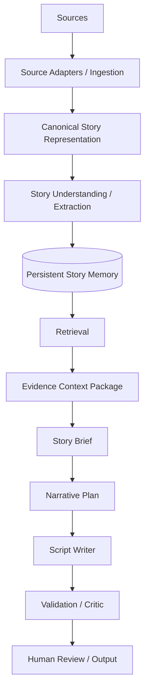
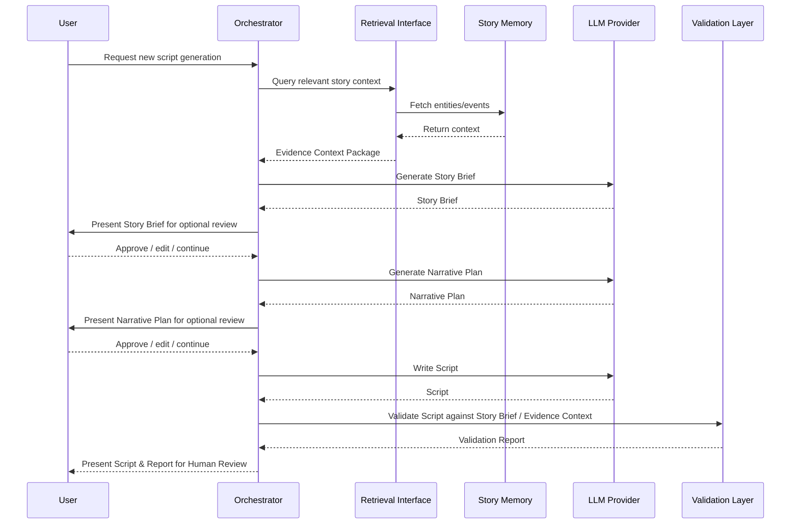

# Target Architecture

**Status:** CANDIDATE TARGET ARCHITECTURE — NOT AN IMPLEMENTATION COMMITMENT

This document describes a long-term capability map and candidate interaction model. It does not freeze specific technologies, require every shown component for the current milestone, or override accepted roadmap and architectural principles.

## 1. Overall Architecture

The story intelligence pipeline targets the following capability flow (Note: this is a target capability flow, not a currently implemented pipeline):



### 1.1 Document Authority
When this target document conflicts with:
- `PRODUCT_VISION.md`
- `MVP_SCOPE.md`
- `ARCHITECTURAL_PRINCIPLES.md`
- `ROADMAP.md`
- accepted `DECISIONS.md`

the accepted foundation takes precedence until an explicit decision changes it.

## 2. Sequence Diagram (Script Generation)



## 3. Provider Boundary and Independence

The architecture abstracts external providers to ensure that RAG and execution are independent of any specific vendor.

**Key Interfaces:**
- `LLM Provider`: Handles text generation and reasoning.
- `Embedding Provider`: Handles vectorization of story context.
- `Storage Adapter`: Manages persistence of raw and processed data.
- `Retrieval Interface`: Abstracts the retrieval mechanism.

Models (e.g., Gemini, OpenAI, Anthropic), databases (e.g., Neo4j, PostgreSQL), and providers are represented as replaceable choices rather than frozen dependencies.

### 3.1 Domain Model vs. Storage
The domain model must not be defined by storage technology. The correct direction of dependence is:
`Canonical Story Model → Storage Adapter → Vector / relational / graph implementations`

## 4. Evidence Context Package (Example)

The architecture distinguishes between raw ingestion and semantic intelligence:
`Source Evidence ≠ Extracted Story Intelligence ≠ Request-Scoped Evidence Context Package`

The Evidence Context Package is a disposable, request-scoped retrieval result assembled for downstream generation. It is distinct from the Persistent Story Memory, which is the long-lived historical story intelligence.

Architectural Principle 4 requires traceability. The context package must demonstrate provenance and epistemic status to prevent flattening differing levels of truth into generic facts.

```yaml
context_package:
  scope:
    story: "Source-Neutral Example"
    chapter_range: "1-3"
    spoiler_boundary: "Chapter 3 ending"

  focus_entities:
    - entity_id: "CHAR_01"
      name: "Protagonist"
      claims:
        - statement: "Is top of their class academically."
          epistemic_status: "EXPLICIT"
          evidence_refs: ["CH1_P4"]
        - statement: "Appears to be hiding a secret regarding the incident."
          epistemic_status: "SUPPORTED_INFERENCE"
          evidence_refs: ["CH2_P12"]

  relevant_events:
    - event_id: "EVT_05"
      statement: "An encounter in the rain."
      epistemic_status: "REPORTED"
      evidence_refs: ["CH3_P1-5"]

  unknowns:
    - "The exact motivation behind the antagonist's intervention in EVT_05 is currently unknown in this scope."

  constraints:
    - "Do not imply romantic feelings at this stage, as they are not supported by the current chapter scope."
```

## 5. Contracts Between Architectural Layers

1. **Source Adapter / Ingestion ↔ Canonical Story Representation**: The ingestion layer preserves source evidence/provenance and converts source-specific material into the shared source-independent representation required by downstream Story Intelligence.
2. **Canonical Story Representation ↔ Story Understanding / Extraction**: Extraction derives grounded entities, events, relationships, information, state changes, and other narrative facts while preserving references to source evidence.
3. **Story Understanding / Extraction ↔ Persistent Story Memory**: Only grounded story understanding that conforms to the Canonical Story Model and required provenance/validation contracts should be persisted as Story Memory.
4. **Persistent Story Memory ↔ Retrieval Interface**: Memory exposes retrievable story evidence and structured context through storage-independent interfaces.
5. **Retrieval Interface ↔ Story Brief**: Must supply a valid Evidence Context Package.
6. **Story Brief ↔ Narrative Plan**: The Story Brief serves as a declared, reviewable factual boundary for downstream narrative stages. It should preserve evidence, uncertainty, and spoiler scope, but remains subject to extraction error and validation. It defines what is currently supported, unknown, uncertain, and in scope. The Narrative Plan decides how supported material should be presented (ordering, pacing, emphasis, hook, callbacks). The Plan may NOT independently create canonical story truth.
7. **Narrative Plan ↔ Script Writer**: The Writer realizes the Narrative Plan while remaining bounded by the Story Brief and Evidence Context. It may use stylistic freedom where that freedom does not introduce unsupported story truth.
8. **Script Writer ↔ Validation / Critic**: Generated Script is evaluated against the declared Story Brief/evidence boundary and applicable Narrative Plan/output contracts. Validation attempts to detect violations but does not guarantee correctness.

### 5.1 Validation Input Contract
Validation inputs are task-dependent, but factual validation must have access to the declared factual boundary and/or corresponding evidence. The Validation / Critic layer cannot validate a Script in isolation. It receives at minimum:
- Generated Script
- declared factual boundary (Story Brief)

And, where needed:
- Evidence Context Package / provenance references
- Narrative Plan / output contract

## 6. Implementation Stages & MVP

### 6.1 Current Research / M1
Evidence gathering around script quality and narrative contracts. M1 research spikes may prototype later-stage capabilities (such as Story Brief or Critic) before their formal milestones. These experiments provide evidence for future architecture but do not count as implementation or milestone completion.

### 6.2 MVP Capability Path
Capabilities needed to reach verified script quality through M9.
- Controlled ingestion
- Canonical representation
- Grounded story understanding / extraction
- Persistent Story Memory
- Retrieval
- Story Brief
- Narrative Plan
- Script
- Validation

**Human Review**: Human inspection is a cross-cutting product principle, not a replacement for a specific milestone. The architecture supports optional review points for key intermediate artifacts.
**Validation / Critic**: Validation attempts to detect factual, temporal, contract, and presentation violations. It is a validation layer, not an infallible guarantee of correctness; unresolved uncertainty or failures may still require human review.

### 6.3 Script Quality Gate
M9 must establish verified script quality and factual reliability before advanced retrieval expansion, additional source formats, or downstream production automation are treated as progression-ready.

### 6.4 Post-Quality-Gate Expansion (M10–M14)
Advanced capabilities like GraphRAG, temporal retrieval, or production automation are future roadmap trajectories, not mandatory MVP infrastructure.

## 7. Roadmap Mapping

The following table maps the target capabilities directly to the accepted roadmap. Concepts such as the Evidence Context Package or LLM Providers are architectural concepts supporting these milestones, not replacements for them.

| Milestone | Accepted Capability                 | Architecture Relationship                           |
| --------- | ----------------------------------- | --------------------------------------------------- |
| M1        | Script Quality & Narrative Contract | Empirically define output/validation contracts      |
| M2        | Canonical Story Model               | Define source-independent story representation      |
| M3        | Light Novel Ingestion               | Initial source adapter                              |
| M4        | Story Extraction                    | Build grounded story understanding                  |
| M5        | Persistent Story Memory             | Persist story intelligence across progression       |
| M6        | Retrieval Baseline                  | Retrieve relevant evidence/context                  |
| M7        | Story Brief                         | Build reviewable factual boundary                   |
| M8        | Narrative Planning                  | Decide presentation strategy                        |
| M9        | Script Generation & Validation      | Produce and validate major output                   |
| M10       | Advanced Narrative Retrieval        | Improve complex contextual retrieval                |
| M11       | Temporal / Graph Story Memory       | Add structural/temporal reasoning based on evidence |
| M12       | Manga Ingestion                     | Add source adapter for manga                        |
| M13       | Visual Production                   | Convert scripts to visual production planning       |
| M14       | Voice & Video Automation            | Automate downstream production                      |

*(Status Legend: **M1** is experimentally explored. **M2-M9** are candidate capabilities not yet implemented. **M10-M14** are future/evidence-gated.)*
