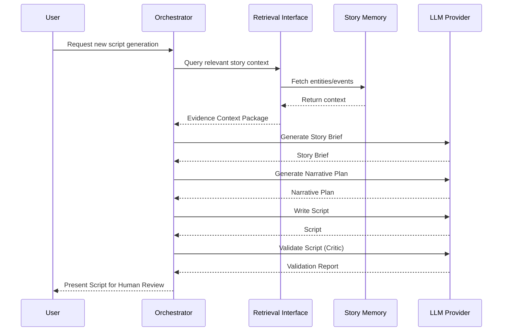

# Target Architecture

**Status:** Candidate Capability / Target Architecture

This document outlines the proposed target architecture for the AI-storytelling pipeline, focusing on story intelligence, retrieval, and script generation.

## 1. Overall Architecture

The story intelligence pipeline follows this data flow:

Source
→ Ingestion / Canonical Representation
→ Story Understanding
→ Story Memory
→ Retrieval
→ Evidence Context Package
→ Story Brief
→ Narrative Plan
→ Script Writer
→ Validation
→ Human Review / Output

## 2. Sequence Diagram (Script Generation)



## 3. Provider Boundary and Independence

The architecture abstracts external providers to ensure that RAG and execution are independent of any specific vendor (e.g., Gemini, OpenAI, Anthropic).

**Key Interfaces:**
- `LLM Provider`: Handles text generation and reasoning.
- `Embedding Provider`: Handles vectorization of story context.
- `Storage Adapter`: Manages persistence of raw and processed data.
- `Retrieval Interface`: Abstracts the retrieval mechanism.

Models, databases, and providers are represented as replaceable choices rather than frozen dependencies.

## 4. Evidence Context Package (Example)

The Evidence Context Package is the structured context passed to the generative stages, ensuring factual alignment.

```yaml
context_package:
  focus_characters:
    - name: "Mahiru Shiina"
      traits: ["Top student", "Athletic ace", "Reserved neighbor"]
  relevant_events:
    - event_id: "E003"
      description: "Amane gives his umbrella to Mahiru in the rain."
      fact_check_constraints:
        - "Amane gives the umbrella so he won't feel guilty if she catches a cold."
        - "Mahiru does not initially want the umbrella."
```

## 5. Contracts Between Architectural Layers

1. **Ingestion ↔ Story Memory**: Ingestion must produce canonical representations that the storage adapter can index.
2. **Story Memory ↔ Retrieval Interface**: Memory provides queryable facets (vector, graph, or temporal).
3. **Retrieval Interface ↔ Story Brief**: Must supply a valid Evidence Context Package.
4. **Story Brief ↔ Narrative Plan**: The Brief guarantees factual boundaries; the Plan outlines narrative staging.
5. **Narrative Plan ↔ Script Writer**: The Writer must execute the pacing and dialogue dictated by the Plan without violating the Brief.

## 6. MVP vs. Future Capabilities

### MVP-Required Path
- Basic ingestion and canonical representation.
- Simple Story Memory and foundational Retrieval Interface.
- Generation pipeline: Story Brief → Narrative Plan → Script Writer.
- Human-in-the-loop validation.

### Advanced Capabilities (Future)
- **GraphRAG / Temporal Memory**: Complex relationship and timeline tracking.
- **Multi-Source Ingestion**: Blending Web Novel, Light Novel, and Manga sources.
- **Production Automation**: Fully autonomous generation and validation loops.

*(Note: Advanced capabilities like GraphRAG or temporal retrieval are architectural options, not mandatory MVP requirements. Neo4j or similar graph databases are interchangeable examples, not strict dependencies.)*

## 7. Roadmap (M1–M14)

*M1 is the current focus. Later milestones represent future trajectory, not current implementation.*

- **M1**: Script Quality & Narrative Contract (Current)
- **M2**: Canonical Story Model & Core Ingestion
- **M3**: Foundational Story Memory
- **M4**: Basic Retrieval Interface
- **M5**: Evidence Context Package Definition
- **M6**: Automated Story Brief Generation
- **M7**: Automated Narrative Planning
- **M8**: Integrated Script Generation Pipeline
- **M9**: Validation & Critic Pipeline
- **M10**: Human Review / Feedback Loop
- **M11**: Temporal / Graph Memory Capabilities (Advanced)
- **M12**: Multi-Source Integration (Advanced)
- **M13**: End-to-End Orchestration
- **M14**: Production Automation & Scaling
