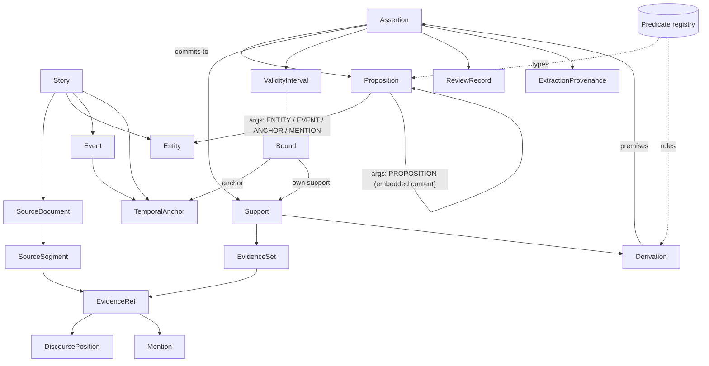

# M2 — Canonical Story Schema v0

Status: RESEARCH PROPOSAL — TASK M2-03. Pending Orchestrator review. Not recorded in `DECISIONS.md`.

## 1. Scope

This document formalizes the M2-02 logical model (`M2_CORE_CONCEPTS_AND_BOUNDARIES.md`), layers L1–L4 only, as a machine-checkable contract.

**Contract artifacts**

| Artifact | Role |
|---|---|
| `schemas/canonical_story/canonical_story_v0.schema.json` | Structural contract (JSON Schema Draft 2020-12) |
| `schemas/canonical_story/predicate_registry_v0.yaml` | Vocabularies, predicates, derivation rules, forbidden stored verdicts, authority policy |
| `tools/canonical_story/conformance_v0.py` | Semantic conformance validator and the normative availability function |
| `tests/canonical_story/` | Synthetic fixtures (A–J valid, 17 negative), the conformance report `conformance_report_v0.json`, and tests |

**Notation, not technology.** JSON Schema is used only as a language-independent interchange and validation notation. It is not a commitment to JSON storage, PostgreSQL, Neo4j, Pydantic, an ORM, or any framework. The validator uses the standard `jsonschema` Python package (≥ 4.18) for Draft 2020-12 and PyYAML for the registry. Both run offline. They are declared in `requirements-canonical-story.txt` (added in M2-04); install with `python -m pip install -r requirements-canonical-story.txt`.

**Out of scope:**
- M3 ingestion and M4 extraction;
- as-of projection queries (M2-04);
- storage and indexing;
- the Story Brief, Narrative Plan, and Script. These stay outside the canonical model and only reference it.

## 2. Object Model

One **Canonical Story document** holds a single story's records in flat, ID-referenced collections:

| Layer | Collection | Record |
|---|---|---|
| — | `story` | Story: id and the discourse stream in which positions are ordered |
| L1 | `source_documents` | SourceDocument: id, story, stream, version, adapter-declared media kind |
| L1 | `source_segments` | SourceSegment: document, DiscoursePosition, adapter-owned locator |
| L1 | `evidence_refs` | EvidenceRef: segment, DiscoursePosition, optional span locator, evidence role |
| L1 | `mentions` | Mention: an evidence ref plus surface form. Resolution is a `RefersTo` assertion. |
| L2 | `entities` | Entity: kind (CHARACTER, LOCATION, OBJECT, GROUP, OTHER), optional placeholder flag. No facts. |
| L2 | `events` | Event: kind and its own EVENT_TIME anchor. **The record does not mean the event occurred.** |
| L2 | `temporal_anchors` | TemporalAnchor: EVENT_TIME (bound to an event) or NAMED_TIME. No truth. |
| L3 | `propositions` | Proposition: predicate plus named typed arguments, or a placeholder. Truth-neutral. |
| L4 | `assertions` | Assertion: the only carrier of canonical commitment |
| L4 | `extraction_provenance` | ExtractionProvenance: how an assertion was produced |

Embedded inside an Assertion:
- **Support:** EvidenceSets and Derivations.
- **ValidityInterval:** each bound may carry its own Support.
- **ReviewRecord.**
- **textual_ambiguity** (optional).

The specializations are not separate record structures:
- **Entity kinds:** Character, Location, Object and Group.
- **Assertion specializations:** Participation, KnowledgeState, TemporalRelation and CausalLink. These are Assertions whose Proposition uses the predicates `Participates`, `Attitude`, `TemporalRelation`, `Causes` and `Enables`.



## 3. Identifier Strategy

- All identifiers are **opaque stable strings** matching `^[A-Za-z0-9][A-Za-z0-9._:-]{0,127}$`. They are unique across the whole document, which the validator checks.
- Prefixes such as `ent-`, `evt-`, `a-` in fixtures are readability conventions only. No rule reads a prefix.
- An identifier must not encode database IDs, graph node IDs, filenames, or source-language names. This is a governance rule. The pattern alone cannot enforce it, so conformance review applies it.
- Names are never identity. They are `NamedAs` assertions. `editorial_label` fields are human-facing, non-identifying, and carry no truth.

## 4. Predicate Model

A Proposition is `predicate` plus `args`, a map from argument name to typed argument:

| Argument kind | Shape |
|---|---|
| ENTITY, EVENT, ANCHOR, MENTION, PROPOSITION | `{kind, ref}`. Reference only, so recursion is bounded and cycles are detectable. |
| LITERAL | `{kind, value_type: STRING / NUMBER / BOOLEAN / DATE, value}` |
| TOKEN | `{kind, vocabulary, value}`. The value must belong to the named registry vocabulary. |

The registry declares for each predicate:
- category and classification;
- whether it is stative (only stative predicates may carry validity);
- ordered named arguments with kind, entity-kind, value-type or vocabulary constraints;
- directionality or symmetry;
- `functional_on` (declared semantics for validation and views, not a storage constraint);
- `epistemic_gate`.

**Initial predicates** (small by design, genre-neutral):

| Family | Predicates |
|---|---|
| Events | `Occurred`, `Participates`, `OccursAt`, `Manner`, `PartOf` |
| Causality | `Causes`, `Enables` |
| Time | `TemporalRelation`, `AnchorDate` |
| Identity | `RefersTo`, `SameAs`, `IdentityKnown`, `SameContent` |
| Naming | `NamedAs`, `AddressesAs` |
| State and relation | `Possesses`, `LocatedAt`, `Regard(holder, target, dimension, level)` |
| Perspective | `Says`, `Attitude` |
| Knowledge flow | `Conveys`, `Conceals` |

`Regard` is a deliberately generic directed relational predicate with a dimension (TRUST, RESPECT, FAMILIARITY, HOSTILITY). No romance-specific concept is part of the foundation. New predicates require a registry revision.

## 5. Proposition and Assertion Rules

**Proposition**
- A Proposition carries no polarity, epistemic status, evidence, review, validity or confidence. The schema forbids those properties (`additionalProperties: false`).
- A placeholder Proposition (`placeholder: true`) stands for content not yet revealed. It is resolved by a `SameContent` assertion.
- One Proposition P can be the content of all of the following. Only the first asserts P:
  - canonical `Assertion(P)`;
  - `Says(A, P)`;
  - `Attitude(A, HOLDS_TRUE, P)`;
  - `Attitude(B, SUSPECTS, P)`.

  `Says` and `Attitude` are registered as **holder-relative**. The validator rejects any derivation that concludes the embedded content of a holder-relative premise (negative fixture 06).

**Assertion** fields: `proposition_id`, `polarity`, `epistemic_status`, `support`, `validity` (stative only), `extraction_provenance_id`, `review`, and optional `textual_ambiguity`.

| Field | Values |
|---|---|
| Polarity | AFFIRMED, NEGATED, OPEN (explicitly undetermined) |
| Epistemic status | EXPLICIT, ENTAILED, SUGGESTED |

REPORTED and UNKNOWN are deliberately absent (§9).

**Event versus occurrence.** An Event record only establishes an identity. Occurrence is the assertion `Occurred(E)`. Participants, roles, location, manner, decomposition and causality are further Assertions. A planned or reported event exists as a record but has no `Occurred` assertion. The schema has no `occurred` or `status` field on Event (negative fixture 08).

**Entity and Mention.**
- Entity identity is name-independent.
- A Mention sits on the evidence side (an evidence ref plus a surface form).
- Mention resolution is `RefersTo(mention, entity)`.
- A late `SameAs(U, A)` is a new assertion with its own availability. Nothing is merged or mutated (case J).

## 6. Grounding: Support Paths

The schema keeps EvidenceSet and Derivation as separate structures inside `support`. This is precisely equivalent to a set of alternative **support paths**:

| Path | Formed by | Complete when |
|---|---|---|
| DIRECT_EVIDENCE_PATH | One EvidenceSet labelled SUFFICIENT | All its refs are in the story's stream and none has a role excluded by the authority policy |
| DERIVATION_PATH | One Derivation: a registered `rule_id` plus **all** `premise_assertion_ids` | The rule is registered and every premise is available |

The rules for support paths:
- **Alternatives.** Paths are alternatives: any one complete path grounds the Assertion.
- **Only SUFFICIENT sets count.** CORROBORATING and PARTIAL sets are retained for audit and never form a path.
- **Per-Assertion labels.** An EvidenceSet is embedded in the one Assertion it is labelled for, so its label cannot be blindly reused for another Assertion. EvidenceRefs are shared.
- **Derived Assertions need no direct evidence.** A derived Assertion does not need its own direct evidence; its grounding is transitive through premises (INV-03).
- **Grounding requirement.** Every non-rejected Assertion needs at least one complete path.

**Evidence roles:** DEPICTION, RETROSPECTIVE, IN_WORLD_REPORT, NARRATION_SUMMARY, PARATEXT.

**Source-authority correction to M2-02.** M2-02 stated that PARATEXT can never support story-world assertions. V0 corrects this: *PARATEXT is not accepted as sufficient story-world grounding under the default authority policy (`DEFAULT_V0`).*
- Authority is governance, not a property of Proposition truth.
- The role remains representable, and a later policy may change the rule without changing the schema.

**V0 narrative assumption.** Ordinary narration is treated as canonical-capable evidence. Unreliable narration is explicitly deferred, not designed away. It would be introduced as an authority policy or a narration-as-holder mechanism.

## 7. Availability (normative)

```text
completion(direct path)     = max DiscoursePosition among the refs of that SUFFICIENT set
completion(derivation path) = max availability among ALL premise assertions
availability(Assertion)     = min completion among its valid complete paths
                              (undefined if none; undefined for REJECTED assertions)
```

- **Validity bounds:**
  - An ANCHOR bound without its own support shares the Assertion's availability.
  - A bound with its own support becomes available at `max(availability(Assertion), min completion of the bound's paths)`.
  - An end bound learned later therefore cannot leak into an earlier as-of view: the view renders it OPEN until then.
- **Cycles.** Derivation cycles have no availability and are rejected.
- **Reader reveal.** The reader-reveal position of content P is the availability of the canonical Assertion of P. This depends on the V0 narrative assumption above and must be revisited with unreliable narration.
- **Tests.** Unit tests cover:
  - a single path;
  - two independent paths;
  - a multi-reference sufficient set;
  - a derivation with several premises;
  - an earlier direct path beating a later derivation;
  - PARTIAL and CORROBORATING evidence being ignored;
  - PARTIAL-only support giving no availability;
  - REJECTED assertions being retained but unavailable.

## 8. Temporal Model

| Concept | Contract |
|---|---|
| DiscoursePosition | `{stream_id, key: [non-negative ints, 1–8], display?}`. Ordered lexicographically within one stream; a shorter prefix sorts first. Adapters map chapters, pages, panels or offsets onto keys. The source meaning stays in locators. V0 compares positions only within the story's single `discourse_stream_id`; the validator rejects evidence outside it. |
| TemporalAnchor | EVENT_TIME (with `event_id`) or NAMED_TIME. No truth; calendar dates are `AnchorDate` assertions. |
| TemporalRelation | Assertion `TemporalRelation(subject, relation, object)` with relation BEFORE, AFTER, SIMULTANEOUS, DURING or OVERLAPS. No interval algebra is implemented. |
| ValidityInterval | `{start, end}` bounds, each OPEN or ANCHOR with optional own support. Only stative predicates may carry one. |

**Story chronology is never inferred from discourse order by default.** Ordering exists only where a TemporalRelation assertion states it. Case B places an event depicted in unit 20 BEFORE an event of unit 1.

## 9. Epistemic Dimensions

These stay separate. None is folded into another.

| Dimension | Where it lives | Note |
|---|---|---|
| Polarity | `Assertion.polarity` | OPEN represents "unknown" (M2-02 §16.3) |
| Epistemic status | `Assertion.epistemic_status` | EXPLICIT, ENTAILED, SUGGESTED only |
| Perspective | Proposition content (`Says`, `Attitude`) | "Reported" is derived from it |
| Textual ambiguity | `Assertion.textual_ambiguity` | Contestation between assertions is derived, not stored |
| Extraction confidence | `ExtractionProvenance.confidence` | Optional. Labelled `meaning: EXTRACTION_CONFIDENCE` with a declared scale. Not a truth probability. V0 fixes no scale. |
| Validation outcome | `ReviewRecord.state` | UNREVIEWED, CONFIRMED, CORRECTED (optionally `corrects_assertion_id`), REJECTED (a reason is required). REJECTED assertions are retained for audit and excluded from truth views. |

**Knowledge.**
- **Stored attitudes:** HOLDS_TRUE, SUSPECTS, PERCEIVES, SEEMS_TO_PERCEIVE, UNAWARE, KEPT_UNAWARE.
- **Computed verdicts:** KNOWS, MISTAKEN and UNRESOLVED_BELIEF are view-time verdicts and appear in the registry's `forbidden_stored_verdicts`. Storing them as a predicate or as an attitude value is rejected (negative fixtures 10 and 11).
- **UNAWARE:**
  - It is never inferred from missing data.
  - It requires a complete support path like any assertion.
  - The only registered rule that concludes it (`BEHAVIOUR_ENTAILS_UNAWARE`) requires depicted behaviour premises.

**Epistemic rules enforced:**
- **No inferred EXPLICIT.** EXPLICIT requires a complete direct evidence path (negative 13).
- **Derivation caps.** A derivation-only status may not exceed the rule's `max_status`, nor the weakest premise (INV-07).
- **INTERNAL_STATE gate** (`Regard`, `Attitude`, `Conceals`). EXPLICIT requires a SUFFICIENT set containing DEPICTION or NARRATION_SUMMARY evidence. Self-report alone (IN_WORLD_REPORT) cannot make an internal state EXPLICIT (negative 16).

## 10. Validation Rules

The conformance report (`tests/canonical_story/conformance_report_v0.json`) separates two layers.

**Structural (JSON Schema).** Shape, required fields, enums, ID pattern, non-empty evidence sets and premise lists, forbidden fields (such as `occurred` on Event, or REPORTED status), and conditional rules (EVENT_TIME anchors need `event_id`; REJECTED needs a reason).

**Semantic (conformance validator).** Seven sections:

| Section | Checks |
|---|---|
| reference_integrity | Global ID uniqueness; every reference resolves to the right record type; event and anchor pairing; evidence in the story stream; acyclic proposition embedding |
| predicate_integrity | Registered predicate; exact named arity; argument kinds, vocabularies, literal types, entity kinds; registered event kinds; forbidden stored verdicts |
| support_path_integrity | Every non-rejected assertion has a support path and at least one complete path |
| derivation_integrity | Registered rule; existing, non-rejected, non-self premises; allowed conclusion predicate and attitude kind; required premise predicates; no cycles; no holder-relative content leakage |
| evidence_set_integrity | Referenced evidence exists; authority policy (PARATEXT not SUFFICIENT under DEFAULT_V0) |
| temporal_bound_integrity | Validity only on stative predicates; bound anchors exist; supported bounds have a complete path; start ≠ end anchor |
| epistemic_integrity | EXPLICIT requires direct evidence; derivation status caps; INTERNAL_STATE gate |

**Results:**
- All ten synthetic cases A–J pass both layers.
- All 17 negative fixtures are rejected, each in its expected layer with its expected message.
- Tests also assert that committed fixtures and the committed report match the builder, so fixtures cannot drift.

## 11. Derived Concepts (not persisted)

The schema has no record type for any of the following. Each remains a projection over Assertions within a view (M2-04):
- Relationship and RelationshipState;
- Secret;
- StoryClaim;
- Alias;
- KNOWS, MISTAKEN and UNRESOLVED_BELIEF;
- contestation;
- reader reveal;
- chronology, progression, comparison and biography.

A test asserts that no such top-level collection exists.

## 12. Known Limitations

1. **Single discourse stream per document.** Multiple editions, translations or parallel streams need an alignment model (deferred).
2. **Registry scope.** The registry is intentionally small. Predicate governance (who may add predicates, and how they are versioned) is not yet defined.
3. **`functional_on` is declared but not enforced** across overlapping validity. Detecting conflicting functional values needs interval reasoning (M2-04 or M11).
4. **ID governance.** The rule that IDs must not encode storage or source names cannot be fully checked mechanically.
5. **Coarse INTERNAL_STATE gate.** It checks evidence roles, not whether the evidence text actually states the internal state. That remains extraction and review responsibility (M4).
6. **Unreliable narration, hypothetical or dream worlds, arcs, themes and foreshadowing** remain deferred (M2-02 §24).
7. **Derivation rules are named contracts, not executable inference.** Their soundness is reviewed, not machine-proven.
8. **Extraction confidence has no fixed scale.**

## 13. M2-04 Handoff

M2-04 may build the **as-of projection** on this contract:
- `View(as_of = N)` includes an Assertion if its availability ≤ N and it is not REJECTED.
- Validity bounds render OPEN when their availability > N.
- Identity closure (`SameAs`), content resolution (`SameContent`) and mention resolution use only visible assertions.
- Derived verdicts (KNOWS, MISTAKEN, UNRESOLVED_BELIEF, CONTESTED), relationship projections, secrets, story claims and reader reveals are computed only from visible assertions.
- The stress-test fixtures A–J and the M2-02 §21 snapshots are the expected conformance targets.

Not part of M2-04 unless explicitly tasked:
- storage;
- retrieval;
- extraction;
- any `DECISIONS.md` entry.
