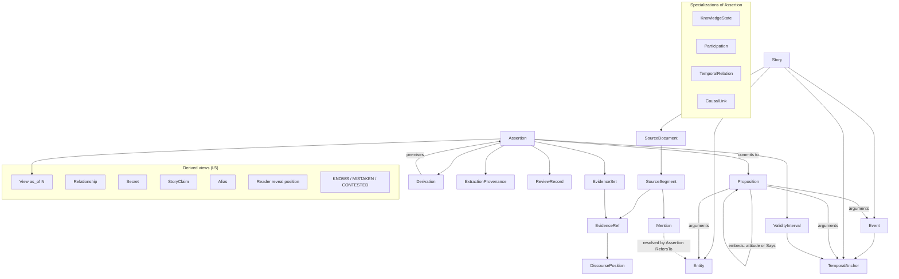

# M2 — Canonical Story Model: Core Concepts and Boundaries

Status: RESEARCH PROPOSAL — TASK M2-02. Pending Orchestrator review. Not an accepted decision.

Scope: logical domain concepts and boundaries only. This is not Canonical Schema v0 (that is M2-03). Pseudo-records below illustrate reasoning; they are not a schema. No storage, index, provider, or extraction technology is selected.

Primary input: `M2_CANONICAL_STORY_MODEL_REQUIREMENTS.md` (INV-01 to INV-18, open questions 1–13). All examples are synthetic and source-neutral.

---

## 1. Core Model Thesis

1. The model separates **what is said** from **who commits to it**. A **Proposition** is truth-neutral content. An **Assertion** is the canonical model's qualified commitment to a Proposition.
2. Every qualification lives on the Assertion, never on the Proposition:
   - polarity;
   - epistemic status;
   - story-time validity;
   - evidence sets;
   - derivation;
   - review outcome.
3. A character's belief, claim or perception is itself canonical content: "A believes P" is an Assertion about an **attitude** Proposition that embeds P. Asserting it never asserts P.
4. **Entities** and **Events** are identity-bearing referents with no built-in facts. Everything known about them, including that an event occurred, who took part, where, when and why, is expressed by Assertions.
5. Relationships, secrets, story claims, aliases, "knows", "mistaken", and reader knowledge are **derived** from Assertions within a view. They are not stored as independent truth.
6. Every Assertion has a computable **availability position**: the earliest discourse position at which its support is complete. An "as of position N" view includes exactly the Assertions available at or before N. This makes spoiler-safe projection a property of provenance rather than a separate bookkeeping system.
7. Chronologies, progressions, comparisons, and biographies are constructed views. Story Briefs and storytelling artifacts sit outside the canonical model and only reference it.

---

## 2. Logical Layers

### 2.1 Evaluation of the proposed five-layer decomposition

The task proposed five layers:

```text
SOURCE / EVIDENCE → CANONICAL REFERENTS → STORY ASSERTIONS → TEMPORAL / EPISTEMIC STATE → DERIVED VIEWS
```

Two adjustments are recommended.

- **Split "story assertions" into content and commitment.** Without a truth-neutral content layer, "A believes X" either asserts X, which breaks INV-08, or needs a second, unrelated representation of X. A separate Proposition layer lets the same X be believed, claimed, asserted, negated, or left open.
- **Remove "temporal / epistemic state" as a separate layer.** Temporal scope, epistemic status and knowledge are qualifications of commitments, not a different kind of thing. As a separate layer they would duplicate evidence, time, and review machinery for states versus facts. Knowledge states become a specialization of Assertion (§8).

### 2.2 Recommended layers

```text
L1  SOURCE & EVIDENCE   SourceDocument, SourceSegment, DiscoursePosition, EvidenceRef, EvidenceSet, Mention
L2  REFERENTS           Entity (typed), Event, TemporalAnchor, placeholder referents
L3  PROPOSITIONS        truth-neutral content over referents (incl. attitude content that embeds a proposition)
L4  ASSERTIONS          canonical commitments: polarity, epistemic status, validity, evidence, derivation, review
L5  DERIVED VIEWS       as-of projections, relationships, knowledge verdicts, secrets, reveals to reader,
                        chronologies, progressions (computed; never canonical truth in their own right)
---------------------------------------------------------------------------------------------------------------
OUTSIDE THE MODEL       retrieval results, Evidence Context Packages, Story Briefs, Narrative Plans, scripts
```

Dependencies point downward only. L5 reads L1–L4. Nothing in L1–L4 depends on L5 or on artifacts outside the model (INV-18).

---

## 3. Assertion (resolved first)

### 3.1 Definition

> An **Assertion** is the canonical model's commitment to one atomic Proposition. It carries a polarity, an epistemic status, and an optional story-time validity. It is supported by one or more evidence sets or derived from premise assertions, and it carries its own extraction provenance and review outcome.

The candidate definition in the task placed "in-world perspective" on the Assertion itself. This proposal rejects that. Perspective lives inside the *content* (an attitude proposition), and the Assertion is always the canonical model's commitment. This yields one commitment representation instead of several.

```yaml
# pseudo-record, not schema
Assertion:
  proposition: → Proposition
  polarity: AFFIRMED | NEGATED | OPEN          # OPEN = explicitly undetermined in scope
  epistemic_status: EXPLICIT | ENTAILED | SUGGESTED
  validity: → ValidityInterval (stative propositions only)
  support: [EvidenceSet...]                     # grounded
  derived_from: → Derivation (premise assertions + rule)   # inferred
  extraction: → ExtractionProvenance
  review: → ReviewRecord
  # computed, not stored: availability_position
```

### 3.2 Answers to the questions in Phase 3

1. **Is Assertion first-class?** Yes. It is the single canonical carrier of truth commitment.
2. **What can it represent?** All of the following, through the Proposition it commits to:
   - entity state;
   - relationship state;
   - event properties (occurrence, participation, location, manner);
   - event dependencies (temporal and causal);
   - identity resolution (`SameAs(U, A)`) and mention resolution (`RefersTo(m, A)`).
3. **Can it be canonical truth, reported, or inferred?**
   - *Canonical truth:* an Assertion of P.
   - *Reported:* an Assertion of `Says(A, P)`. This commits to the saying, not to P.
   - *Inferred:* an Assertion with `derived_from` premises and status ENTAILED or SUGGESTED. It can never be EXPLICIT (INV-07).
4. **Is negation on the assertion?** Yes. Polarity belongs to the Assertion (and, for attitudes, to the embedded content). Propositions are always positive content. P and not-P therefore share one Proposition, which makes contradiction detection direct.
5. **How are contradictions retained?** Conflicting Assertions of the same Proposition with overlapping validity are both kept. Contestation is derived per view, and any resolution is a further Assertion (§15).
6. **What is the operational atomicity rule?** An Assertion is atomic when:
   - its Proposition has exactly one predicate;
   - no qualifier (participant, role, place, time, manner, cause, degree, frequency) could be true while the rest is false.

   Any such qualifier becomes its own Assertion attached to the same referent. For example, "A carried B home by cart" becomes `Occurred(E)`, `Participates(E, A, agent)`, `Participates(E, B, patient)`, `Destination(E, home_of_B)`, and `Manner(E, by_cart)`. M1 observed this failure pattern: a later retrospective passage supported an event but not its manner.

The word "fact" is not used as a technical term. Where this document means canonical truth in a view, it says "affirmed Assertion available in the view".

---

## 4. Assertion vs Information vs KnowledgeState

**Decision: option C.** A Proposition is the knowable content ("Information"). An Assertion commits to it canonically. A KnowledgeState is an Assertion about a holder's attitude toward a Proposition.

- **Proposition (a.k.a. Information).** Truth-neutral, shareable content with identity by content: predicate plus argument referents. "Information" in Principle 7 is this concept. "Proposition" is the preferred technical term because "Information" wrongly suggests truth.
- **Assertion.** The canonical commitment (§3).
- **KnowledgeState.** A specialization of Assertion whose Proposition is an attitude: `Attitude(holder, attitude_kind, content: Proposition, content_polarity)`.

Example, "The key is under the flowerpot":

```yaml
P_key: Proposition  { predicate: LocatedAt, args: [key_1, flowerpot_1] }

# canonical: the narration establishes it (Chapter 4)
S1: Assertion { proposition: P_key, polarity: AFFIRMED, epistemic_status: EXPLICIT, support: [ES(ch4)] }

# A believes it (Chapter 2) — does NOT assert P_key
K1: Assertion { proposition: Attitude(A, HOLDS_TRUE, P_key, AFFIRMED), polarity: AFFIRMED,
                epistemic_status: EXPLICIT, validity: [from E_hide, open), support: [ES(ch2)] }
```

Mistaken belief: B holds that the key is in the drawer (`P_drawer`), and the narration later establishes that it is not:

```yaml
K2: Assertion { proposition: Attitude(B, HOLDS_TRUE, P_drawer, AFFIRMED), epistemic_status: EXPLICIT, support: [ES(ch3)] }
S2: Assertion { proposition: P_drawer, polarity: NEGATED, epistemic_status: EXPLICIT, support: [ES(ch9)] }
# View(as_of < ch9): B holds P_drawer; truth of P_drawer not established.
# View(as_of ≥ ch9): derived verdict MISTAKEN(B, P_drawer). The verdict is never stored.
```

K1 and K2 are canonical Assertions *about attitudes*. Neither asserts its content, which satisfies the Phase 4 requirement.

---

## 5. StoryClaim

**Recommendation: DERIVED/COMPOSED.** One Proposition P can be targeted four ways with no new concept:

| Situation | Representation |
|---|---|
| Narrator / source states P | Assertion(P, EXPLICIT), evidence role NARRATION |
| Character A says P | Event of kind `Utterance` + Assertion(`Says(A, P)`), evidence role DEPICTION; no Assertion of P |
| Character A believes P | Assertion(`Attitude(A, HOLDS_TRUE, P)`) |
| Canonical model asserts P by inference | Assertion(P, ENTAILED/SUGGESTED, derived_from premises) |

A "story claim" is a view over `Says` and `Attitude` assertions that target P. A separate concept would duplicate the evidence, time and review machinery that the Assertion already carries. The target architecture's `REPORTED` label is produced from this composition (§16).

Deferred edge case: an unreliable narrator, whose narration is not canonical. This would require treating narration as a holder's claim. It is deferred (§24), not ruled out.

---

## 6. Entity Model

| Question | Answer |
|---|---|
| Is Character just `Entity(kind=CHARACTER)`? | Yes: a SPECIALIZATION by kind. Its only distinct capability is to hold attitudes and act as agent, and that is a constraint on which propositions are well-formed, not a separate structure. |
| Is Location an Entity type? | Yes (SPECIALIZATION). Containment ("inside") is an Assertion. |
| Is Object an Entity type? | Yes (SPECIALIZATION). Introduce objects only where they carry story state (possession, lending). |
| Group? | Entity kind GROUP. Membership is time-scoped Assertions. |
| Is Alias a property or a pattern over Mentions? | Neither by itself. Stated names, titles and epithets are **naming Assertions** (`NamedAs(entity, name, name_kind)`, time-scoped, evidenced). Observed usage is Mentions. "Alias" is a DERIVED view over both. Forms of address are directed relational Assertions (`AddressesAs(A, B, form)`) because they change as story events (INV-02). |
| How is a temporarily unidentified person represented? | A **placeholder Entity** ("U: the stranger at the station"), fully first-class with its own Mentions and Assertions. Entity identity never depends on being identified (INV-01). |
| How does later resolution avoid rewriting history? | Resolution is an Assertion `SameAs(U, A)` with its own evidence and availability position. Nothing is merged or rewritten. Views before that position show U and A as distinct; views after it derive their equivalence. `RefersTo(mention, entity)` links are likewise Assertions and can be revised by adding, never by editing. |

**Mention** (L1) is a located surface reference: segment, span, surface form, and discourse position. Resolving it is an Assertion. A Mention is evidence, not identity.

---

## 7. Event Model

- An **Event** is a referent: the identity of one occurrence. It carries no truth by itself. It has its own TemporalAnchor (§13).
- Everything about an Event is an Assertion:

| Aspect | Representation |
|---|---|
| That it occurred | `Occurred(E)`. Distinguishes actual events from planned, hypothetical, dreamt, or merely reported ones, which appear only inside attitude or `Says` content. |
| Participants and roles | `Participates(E, entity, role)`: one Assertion per participant-role, each evidenced separately. |
| Location | `OccursAt(E, location)` |
| Temporal placement | `TemporalRelation` Assertions between anchors (§13) |
| Decomposition | `PartOf(E_sub, E_whole)` |
| Dependencies / causality | `Causes(E1, E2)`, `Enables(E1, E2)`: CausalLink Assertions with their own epistemic status. Causality is never a default (INV-07; H6b `CAUSALITY_INVENTION`). |
| Manner / degree | `Manner(E, …)`, per the atomicity rule |

Example, "A lends an umbrella to B", as four distinct things:

```yaml
E_lend: Event { kind: Transfer/Lend, anchor: T_E_lend }                       # the event (referent)
O1: Assertion { Occurred(E_lend), EXPLICIT, support: [ES(ch1)] }               # that it occurred
P1: Assertion { Participates(E_lend, A, giver), EXPLICIT, support: [ES(ch1)] } # participation
P2: Assertion { Participates(E_lend, B, recipient), EXPLICIT, support: [ES(ch1)] }
P3: Assertion { Participates(E_lend, umbrella_1, theme), EXPLICIT, support: [ES(ch1)] }
S1: Assertion { Possesses(B, umbrella_1), ENTAILED,                            # resulting state
                validity: [start: T_E_lend, end: open), derived_from: {premises: [O1, P1, P2, P3], rule: TRANSFER_RESULT} }
```

The resulting state is ENTAILED from the event by an explicit, reviewable rule. It is not silently assumed.

---

## 8. State Model

**Decision: Option C (hybrid).**

- All stative predications (entity state, relational dimensions) use the single Assertion abstraction with a validity interval, as in Option A. The predicate comes from a typed **predicate vocabulary** whose entries declare semantics:
  - kind (location, possession, physical condition, emotional, goal/intention, social status, relational dimension, naming/address);
  - arity and argument kinds;
  - directionality or symmetry;
  - functionality (at most one value at a time, for example location);
  - persistence (whether an unbounded state may be *presumed* to continue, which is always shown as presumed, never as affirmed);
  - minimum epistemic gate (§17).
- **KnowledgeState is a separate specialization.** Attitude content embeds a Proposition, has holder-relative semantics and acquisition, and has factivity rules (KNOWS and MISTAKEN are derived). Those rules do not fit a generic subject–predicate–value form without special-casing.
- `StateAssertion` and `RelationshipState` are therefore not separate concepts: they are Assertions with stative or relational predicates.

Why not Option B (separate EntityState, RelationshipState and KnowledgeState structures)? It would triplicate evidence, time, polarity and review handling, and invite drift between parallel structures. That is the same failure M1 hit between duplicated fixture and audit representations. Option A alone would hide the genuinely different attitude semantics.

---

## 9. Relationships

**Decision: Relationship is DERIVED (a projection), not an identity-bearing object.**

Directed relational predicates are Assertions:

| Example | Predicate semantics |
|---|---|
| A is B's neighbour | `NeighbourOf(A, B)`: symmetric, spatial or social, stable |
| A trusts B | `Trusts(A, B)`: directed, attitudinal; evidence gate applies (§17) |
| A calls B by given name | `AddressesAs(A, B, given_name)`: directed, observable, changes as an event |
| A is romantically interested in B | `RomanticInterest(A, B)`: directed, internal state; high evidence gate |

- **Relationship(A, B)** is the view grouping all relational Assertions between A and B in either direction, per dimension.
- **Progression** is reconstructed by ordering the Assertions of one dimension by validity (story time), falling back to availability position (discourse), within an as-of view.
- **A persistent Relationship object is rejected** because nothing about "the relationship" is true except through its dimensions. Where a bond itself has properties (a marriage, a contract, a club membership), that is an Event (`Marries`) or a Group Entity with its own Assertions.
- **Symmetry** is declared per predicate. It is never assumed.

---

## 10. Information and KnowledgeState

- **Information** is a Proposition (§4). It identifies content by predicate and arguments, and it may be a **placeholder Proposition** whose content is not yet revealed ("A knows something about B's past"). A later Assertion `SameContent(P_placeholder, P_concrete)` resolves it, mirroring entity resolution.
- **Different attitudes toward the same Information:** yes. Many KnowledgeState Assertions can target one Proposition with different holders, attitudes, and validity.

**Stored attitude kinds** (conceptual; the final vocabulary belongs to M2-03):

| Attitude | Meaning | Note |
|---|---|---|
| HOLDS_TRUE | Holder accepts the content (with content polarity) | Belief. Not factive. |
| SUSPECTS | Holder entertains the content as likely | |
| PERCEIVES / SEEMS_TO_PERCEIVE | Holder perceives, or reports uncertainly perceiving | Captures hedged perception (M1 finding 5) |
| UNAWARE | Holder lacks awareness of the content | Requires positive evidence (below) |
| KEPT_UNAWARE | UNAWARE caused by another's withholding | Links to a withholding Assertion |

**Derived verdicts** (never stored, computed within a view):

| Derived verdict | Rule within view V |
|---|---|
| KNOWS(h, P) | HOLDS_TRUE(h, P) ∧ canonical P AFFIRMED in V |
| MISTAKEN(h, P) | HOLDS_TRUE(h, P) ∧ canonical P NEGATED in V |
| UNRESOLVED_BELIEF(h, P) | HOLDS_TRUE(h, P) ∧ no canonical commitment to P in V |

Storing KNOWS would assert P and could leak future truth into earlier views, because whether a belief is knowledge can depend on later evidence.

**UNAWARE under an open world.** Absence of an attitude Assertion means *no information*, never unawareness (INV-14). UNAWARE may be asserted only with positive evidence:
- explicit statement ("B had no idea that…") gives EXPLICIT;
- behaviour that entails ignorance (B asks where the key is) gives ENTAILED;
- behaviour that merely suggests it gives SUGGESTED.

Views must render "no attitude recorded" differently from UNAWARE.

**Acquisition.** An attitude's validity start is anchored to an acquisition Event (a Reveal, §12) when one is evidenced, or left open.

---

## 11. Secret

Test: is a secret anything more than Information plus intended withholding plus holder-relative knowledge states?

- The "intended withholding" is itself representable as an Assertion: `Conceals(A, P, from: B)` (an act or intention with its own evidence and gate, §17).
- Given that Assertion, "P is A's secret from B during I" is fully determined by `Conceals(A, P, B)`, `Attitude(A, HOLDS_TRUE, P)`, and B's attitude or unawareness over I.
- No additional invariant is gained.

**Decision: DERIVED.** A secret is a view pattern. Its reveal to B is the Reveal event that ends B's unawareness; its reveal to the reader is a derived position (§12).

---

## 12. Reveal

| Kind | What it is | Representation |
|---|---|---|
| Explicit telling | A tells B that P | Event kind `Reveal/Tell` with participants (source, recipient) and a content Assertion `Conveys(E, P)`. B's attitude validity starts at E. |
| Discovery | B finds evidence of P in the story world | Event kind `Reveal/Discover`, recipient B, content P |
| In-story inference | B works out P | Event kind `Reveal/Infer` (B's reasoning, as depicted), plus B's resulting attitude |
| Narrator reveal / reader reveal | The source first makes P available to the reader | Not a story-world event. DERIVED: the availability position of the canonical Assertion of P (§14.3) |

**Decision:**
- Character-directed reveals (telling, discovery, inference) are an **Event specialization** (`Reveal`). They happen in story time and have participants.
- Reader reveal is **DERIVED** from provenance.

Three times stay distinct (INV-13):

| Time | Where it lives |
|---|---|
| Truth time | The validity of the canonical Assertion of P, in story time |
| Character learn time | The anchor of the Reveal event, or the validity start of the holder's attitude, in story time |
| Reader reveal position | The availability position of the Assertion of P, in discourse |

---

## 13. Temporal Model

### 13.1 Is T-7 sufficient for M4?

Yes, with two additions:
1. containment and overlap relations ("during", "overlaps") for "during the festival";
2. the explicit rule that story-time order is never inferred from discourse order by default.

Chronological order from presentation order may be asserted only as ENTAILED or SUGGESTED with a stated cue.

### 13.2 Conceptual roles

| Concept | Role | Status |
|---|---|---|
| DiscoursePosition | Total order of presentation within one source edition: an ordered, source-neutral locator (volume, chapter, segment, offset; or page and panel). Belongs to evidence. | CORE |
| TemporalAnchor | A point or span in story time: an event's time, a named time ("the morning of the trip"), or a stated calendar date when present | CORE |
| TemporalRelation | An Assertion relating anchors: BEFORE, AFTER, SIMULTANEOUS, DURING, OVERLAPS. Evidenced and epistemically qualified like any Assertion. | SPECIALIZATION of Assertion |
| ValidityInterval | Start and end bounds of a stative Assertion, each an anchor or OPEN. **Each bound carries its own support**, because the end of a state is often learned later. | Part of Assertion |

### 13.3 Coverage

| Need | How it is covered |
|---|---|
| Known exact date | Anchor with calendar value, evidenced |
| Relative before/after | TemporalRelation Assertions (partial order; no total order required) |
| Simultaneous or overlap | SIMULTANEOUS, DURING, OVERLAPS relations |
| Unknown | No relation. The anchor exists; its order is simply unconstrained. An explicit "timing unknown" is an OPEN Assertion. |
| Flashback | An evidence DiscoursePosition in Chapter 20 supports `Occurred(E)` whose anchor is related BEFORE an anchor of a Chapter 1 event. The two axes are independent (INV-09). |
| Retrospective mention | An EvidenceRef with role RETROSPECTIVE, positioned late, supporting Assertions about an early anchor (INV-11) |

Interval algebra and constraint solving are deliberately not specified. A small relation set suffices for extraction and validation at M4, and richer reasoning belongs to M11.

---

## 14. Provenance Model

### 14.1 Concepts

| Concept | Responsibility |
|---|---|
| SourceDocument | Identity and version of an ingested source unit (work, edition, volume, chapter file) |
| SourceSegment | Stable addressable unit within a document (passage, panel). Segmentation method is an adapter concern; the model needs stable, re-resolvable references (P-7). |
| EvidenceRef | A pointer to a segment, plus an optional exact span, a DiscoursePosition, and an **evidence role**: DEPICTION, RETROSPECTIVE, IN_WORLD_REPORT, NARRATION_SUMMARY, or PARATEXT. PARATEXT (author notes, afterwords) can never support story-world Assertions. |
| EvidenceSet | A group of EvidenceRefs attached **to one Assertion**, labelled by its relation to that Assertion |
| ExtractionProvenance | How an Assertion was produced: process, version, run, reviewer. Separate from source evidence. |
| Derivation (DerivedFrom) | Premise Assertions plus a named rule for inferred Assertions. Grounding is transitive (INV-03, INV-07). |

### 14.2 Evidence-set labels (relative to one Assertion)

| Label | Meaning |
|---|---|
| SUFFICIENT | This set alone supports the whole Assertion. An Assertion may have several independent SUFFICIENT sets (multi-path, INV-04). |
| CORROBORATING | Supports the Assertion but is not needed for it, or is weaker |
| PARTIAL | Supports only some required aspect. Kept for audit, never counted as grounding. |

- Evidence role and set label are independent. A RETROSPECTIVE ref can be part of a SUFFICIENT set for one Assertion (that the carrying happened) and absent from any set for another (the manner of carrying). That is M1 finding 3 and stress test I.
- No evidence set proves an Assertion automatically. Sufficiency is a per-Assertion judgement recorded with review provenance.

### 14.3 Availability position

For a grounded Assertion:

```text
availability(A) = min over SUFFICIENT sets S of ( max over refs r in S of position(r) )
```

For a derived Assertion:

```text
availability(A) = max( availability of each premise, availability of any own SUFFICIENT evidence )
```

- For an Assertion with several derivations or evidence paths, the minimum over those alternatives applies.
- The two ends of a validity interval have their own availability, which is how an end that is learned later stays hidden.
- **Spoiler-safety asymmetry.** Missing an earlier evidence path makes availability later than it truly is, which is safe (a spoiler is hidden longer). A mis-positioned evidence reference can make it too early, which leaks. Positions must therefore be mechanically derived from source locators, not asserted by extraction.

---

## 15. Contradictions (INV-15 with INV-12)

Scenario:
- A says X (position 5).
- B says not-X (position 7).
- The narrator establishes X (position 12).

```yaml
C1: Assertion { Says(A, P_X, AFFIRMED), EXPLICIT, support: [ES(pos5)] }   # availability 5
C2: Assertion { Says(B, P_X, NEGATED),  EXPLICIT, support: [ES(pos7)] }   # availability 7
R1: Assertion { P_X, AFFIRMED, EXPLICIT, support: [ES(pos12)] }          # availability 12
```

| View | Visible Assertions | Derived status of P_X |
|---|---|---|
| as_of 6 | C1 | Reported by A only; canonical truth not established |
| as_of 8 | C1, C2 | CONTESTED between holders; canonical truth not established |
| as_of 12 | C1, C2, R1 | Canonical AFFIRMED; B's claim derived as contradicted |

- Nothing is deleted. Holder claims remain.
- The canonical resolution R1 does not exist in earlier views because its availability is 12 (INV-12).

The same rule covers conflicting *canonical* Assertions (for example a later retcon):
- both are retained;
- the view derives CONTESTED where their validity overlaps;
- any adjudication is an additional Assertion with its own availability, never an edit.

---

## 16. Epistemic Vocabulary

### 16.1 Separate dimensions (not one enum)

| Dimension | Carried by | Values (conceptual) |
|---|---|---|
| Polarity | Assertion (and attitude content) | AFFIRMED, NEGATED, OPEN |
| Epistemic status | Assertion | EXPLICIT, ENTAILED, SUGGESTED |
| Perspective | Proposition content | Canonical content vs `Says` / `Attitude` content (§5) |
| Contestation / ambiguity | Derived per view (CONTESTED); textual ambiguity recorded as a flag with alternative readings | NONE, CONTESTED, AMBIGUOUS |
| Extraction confidence | ExtractionProvenance | Ordinal or numeric; never displayed as truth level |
| Validation outcome | ReviewRecord | UNREVIEWED, CONFIRMED, CORRECTED, REJECTED (reasons such as UNSUPPORTED, WRONG_EVIDENCE, OVERSTATED) |

- REJECTED Assertions are retained for audit and excluded from canonical views.
- Presentation labels for downstream packages are derived:
  - `REPORTED` means the Proposition appears only as `Says` or `Attitude` content in the view;
  - `UNKNOWN` means an OPEN Assertion in the view, or a request-level unknown declared by a Story Brief.

### 16.2 Mapping (historical labels are not rewritten)

| Source vocabulary | Label | Maps to |
|---|---|---|
| M1 | DIRECTLY_EXPLICIT | Epistemic EXPLICIT |
| M1 | STRONGLY_ENTAILED | Epistemic ENTAILED |
| M1 | INTERPRETIVE_INFERENCE | Epistemic SUGGESTED |
| M1 | AMBIGUOUS | Contestation AMBIGUOUS (not an epistemic level) |
| M1 | UNSUPPORTED | Validation outcome REJECTED/UNSUPPORTED (not a truth state) |
| Target architecture | EXPLICIT | Epistemic EXPLICIT |
| Target architecture | SUPPORTED_INFERENCE | Epistemic ENTAILED by default; SUGGESTED where the support is interpretive. The label is coarser than the M2 levels, so mapping requires review. |
| Target architecture | REPORTED | Derived presentation label from perspective (§5), not an epistemic level |
| M2-01 | EXPLICIT / ENTAILED / SUGGESTED | Unchanged |
| M2-01 | REPORTED | Moved to perspective (derived label) |
| M2-01 | UNKNOWN | Moved to polarity OPEN |

### 16.3 Proposed amendment to INV-06

INV-06 required one epistemic status distinguishing explicit, reported, entailed, interpretive, and unknown. This proposal keeps all five distinctions, but places them on three orthogonal dimensions:
- epistemic status: EXPLICIT, ENTAILED, SUGGESTED;
- perspective: reported;
- polarity: unknown / OPEN.

A single enum would conflate who holds the content with how strongly the canonical model is committed to it. "A reported X" would then compete with "X is entailed" for one slot, even though both can be true at once.

Proposed wording: *INV-06 (amended): Every Assertion carries polarity and epistemic status; reported and unknown content are distinguished through perspective and OPEN polarity. Explicit, reported, entailed, suggested and unknown must remain distinguishable in every view, and none may be collapsed into an unqualified truth state. Epistemic status is distinct from extraction confidence, contestation, and validation outcome.*

This does not weaken the invariant.

---

## 17. Emotion, Intention, Goal, Motivation

These predicates carry a **minimum epistemic gate** in the predicate vocabulary (§8), because they are the families M1's critic most often saw invented (H6b):
- `MOTIVE_OR_INTERNAL_STATE_INVENTION`;
- `HIDDEN_INTENTION_INFERENCE`;
- `EPISTEMIC_KNOWLEDGE_OVERCLAIM`.

| Source situation | Canonical representation | Maximum status |
|---|---|---|
| Narrator states A's emotion or intention | Assertion of the internal-state Proposition | EXPLICIT |
| Close-perspective narration of A's own thought or feeling (focalized) | Assertion of A's internal state | EXPLICIT, for the focal character only |
| A says what they feel or intend | `Says(A, Feels(A, e))`: EXPLICIT for the saying. The internal state itself is at most SUGGESTED unless independently corroborated (characters may conceal or misstate). | SUGGESTED, raised to ENTAILED only with new corroborating evidence |
| Visible behaviour suggests an emotion | Internal-state Assertion with `derived_from` the behaviour Assertions | SUGGESTED |
| Behaviour entails a goal (for example A repeatedly searches for the key, stated as a search) | Goal Assertion derived from the stated actions | ENTAILED |
| The model's interpretation without a textual cue | Not stored. A candidate would receive validation outcome REJECTED/UNSUPPORTED. | — |
| A's internal state asserted from B's point of view ("B thought A was angry") | `Attitude(B, HOLDS_TRUE, Angry(A))`, never `Angry(A)` itself | — |

- Interpretation is allowed, but only honestly labelled as SUGGESTED with premises.
- Downstream validators can then flag scripts that state a SUGGESTED internal state as certain (H6b `CERTAINTY_INFLATION`).

---

## 18. Reader Model

**Decision: Option B (reader knowledge is a view), with a derived reader-reveal position. The reader is not a stored holder.**

| Scenario | How it is handled |
|---|---|
| Spoiler queries | Answered directly by the as-of view at position N |
| Narrator withholding | Content absent from all evidence before N is not in the view. A placeholder Proposition (§10) represents "A knows something the reader is not told". |
| Reader learns P before B | Assertion of P is available at position 10. B's attitude starts at the Reveal to B, anchored in story time and itself available at position 15. The view at 12 shows the canonical P with B's awareness not yet recorded. |
| B knows P before the reader | `Attitude(B, HOLDS_TRUE, P_placeholder)` is available early. `SameContent(P_placeholder, P)` and the canonical P become available later. |

Why not a stored reader holder: it would duplicate the availability information already implied by provenance and invite inconsistency. Option A becomes necessary only if narration can be *misleading*. That is the unreliable-narrator case, deferred in §24; it would need the narration itself to act as a holder.

---

## 19. Composite Answers

| Composite | Persisted canonical truth? | Constructed as |
|---|---|---|
| Chronology | No | Ordering of `Occurred` events by TemporalRelations within a view |
| Relationship progression | No | Ordering of one relational dimension's Assertions (§9) |
| Comparison | No | Selection of Assertions for two subjects plus their evidence |
| Character biography | No | View over all Assertions about an entity (plus SameAs closure) as of N |
| Story Brief, Evidence Context Package | Outside the model | Request-scoped artifacts that reference Assertions by identity |

- Compute rather than store anything whose truth is determined by other Assertions.
- A cache is an implementation matter. Any cached view must record the as-of position and the Assertion identities it was built from, so staleness is detectable.
- Storytelling artifacts may select, order and phrase, but never write back (INV-18, DEC-006).

---

## 20. Source-Neutral Stress Tests (synthetic)

Positions are discourse positions (chapter numbers). `ES(n)` is a SUFFICIENT evidence set whose latest ref is at chapter n. "Avail" is the availability position.

### Case A — Multiple names

```yaml
A: Entity { kind: CHARACTER }
N1: Assertion { NamedAs(A, "Formal Name", FORMAL), EXPLICIT, support: [ES(1)] }
N2: Assertion { NamedAs(A, "Nickname", NICKNAME), EXPLICIT, support: [ES(3)] }
N3: Assertion { NamedAs(A, "The Title", TITLE), EXPLICIT, support: [ES(2)] }
F1: Assertion { AddressesAs(B, A, family_name), EXPLICIT, validity: [open, T_E_rename), support: [ES(2)] }
F2: Assertion { AddressesAs(B, A, given_name),  EXPLICIT, validity: [T_E_rename, open), support: [ES(8)] }
E_rename: Event { kind: AddressChange }     # the change of address is itself a story event
m1..mk: Mention { surface forms... } + RefersTo(m_i, A) assertions
```
Result: representable. Identity does not depend on any name, and the address change is evidenced and time-scoped.

### Case B — Flashback

```yaml
E_old: Event;  O: Assertion { Occurred(E_old), EXPLICIT, support: [ES(20) role: DEPICTION] }
T: Assertion { TemporalRelation(anchor(E_old) BEFORE anchor(E_ch1_opening)), EXPLICIT, support: [ES(20)] }
```
Result: representable. The event's story time precedes Chapter 1, and its availability is 20.

### Case C — Possession A → B → A

```yaml
S1: Possesses(A, obj) validity [open, T_E1)        support ES(1)
E1: Event Transfer A→B;  S2: Possesses(B, obj) [T_E1, T_E2)  ENTAILED from E1   avail 4
E2: Event Transfer B→A;  S3: Possesses(A, obj) [T_E2, open)  ENTAILED from E2   avail 9
# S1's end bound and S2's end bound are supported by E1 and E2 respectively (own availability)
```
Result: representable. History is appended, not overwritten (INV-10).

### Case D — Relationship progression

```yaml
R1: Distrusts(A, B)  [open, T_x)   EXPLICIT  avail 2
R2: TrustNeutral(A, B) [T_x, T_y)   SUGGESTED derived_from behaviour at ch 6   avail 6
R3: Trusts(A, B)   [T_y, open)   EXPLICIT  avail 11
```
Result: representable. The view Relationship(A, B) orders R1 → R2 → R3, and the direction A→B is kept.

### Case E — Secret; the reader learns before B

```yaml
P_X: Proposition
K_A: Attitude(A, HOLDS_TRUE, P_X)    EXPLICIT avail 3
C:   Conceals(A, P_X, from: B)       EXPLICIT avail 3
U_B: Attitude(B, UNAWARE, P_X)       ENTAILED (B asks about it) avail 4
S_X: P_X AFFIRMED                    EXPLICIT avail 7     # reader reveal position = 7
E_rev: Event Reveal/Tell {source: A, recipient: B}, Conveys(E_rev, P_X)  avail 15
K_B: Attitude(B, HOLDS_TRUE, P_X) [T_E_rev, open) avail 15; U_B validity ends at T_E_rev (end bound avail 15)
```
Result: representable. The derived secret holds from 3 to 15; the reader learns at 7 and B learns at 15.

### Case F — Mistaken belief

```yaml
K_B: Attitude(B, HOLDS_TRUE, P_Y)   EXPLICIT avail 5
S_Y: P_Y NEGATED                    EXPLICIT avail 18
```
Result: representable. As of 10 the belief is unresolved; as of 18 the derived verdict is MISTAKEN(B, P_Y). Nothing about P_Y was asserted before 18.

### Case G — Reported claim, truth unknown

```yaml
E_say: Event Utterance;  C: Says(A, P_X, AFFIRMED) EXPLICIT avail 6
# no Assertion of P_X at any position (or an OPEN Assertion if the text marks it as uncertain)
```
Result: representable. The downstream label is REPORTED, and canonical truth is not established.

### Case H — Multi-path provenance

```yaml
P: Assertion { Occurred(E_meet), EXPLICIT,
   support: [ ES_a: {ref(ch8, DEPICTION)} SUFFICIENT,
              ES_b: {ref(ch20, RETROSPECTIVE)} SUFFICIENT ] }
# availability = min(8, 20) = 8
```
Result: representable. Either path grounds P, and multi-gold scoring maps directly onto the sufficient sets.

### Case I — Partial retrospective support

```yaml
P1: Occurred(E_carry)        support: [ES(ch5 DEPICTION) SUFFICIENT, ES(ch12 RETROSPECTIVE) SUFFICIENT]
P2: Manner(E_carry, by_cart) support: [ES(ch5 DEPICTION) SUFFICIENT]
    # the ch12 ref appears in no SUFFICIENT set for P2 (optionally PARTIAL for audit)
```
Result: representable. The retrospective passage grounds P1 only; atomicity (§3.2) keeps P2 separable.

### Case J — Explicit unknown identity, resolved later

```yaml
U:  Entity { kind: CHARACTER, placeholder: true }   # "the stranger"
OQ: Assertion { IdentityKnown(U), polarity: OPEN, EXPLICIT, support: [ES(4)] }   # text marks the identity as unknown
R:  Assertion { SameAs(U, A), EXPLICIT, support: [ES(22)] }                     # avail 22
```
Result: representable. Before 22, U is a distinct entity with an explicit unknown; from 22 on, the U≡A closure is derived.

All ten cases are representable without new concepts beyond §22.

---

## 21. Leak-Free As-Of View

### 21.1 Projection rules for `View(as_of = N)`

1. Include an Assertion only if `availability ≤ N`. This excludes later evidence and later inferences whose premises are later (§14.3).
2. Include an evidence set only if its latest ref is at or before N. An Assertion whose only sufficient sets are later is excluded even if a PARTIAL set is early.
3. Validity bounds whose supporting availability is after N are rendered OPEN. The end of a state is not visible before it is available.
4. Identity closure (SameAs), content resolution (SameContent), and mention resolution use only resolution Assertions available at or before N.
5. Derived verdicts (KNOWS, MISTAKEN, CONTESTED, secret, relationship stage, progression) are computed only from the Assertions visible in the view.
6. Reader reveal equals availability. A placeholder whose resolution is later stays a placeholder.
7. Rejected Assertions are never visible. Unreviewed Assertions are visible with their review status.

### 21.2 Snapshots

Using cases E, F and J together.

**View(as_of = 5)**

```yaml
entities: [A, B, U(placeholder)]            # SameAs(U, A) avail 22 → not visible
assertions:
  - Attitude(A, HOLDS_TRUE, P_X)            # avail 3
  - Conceals(A, P_X, from: B)               # avail 3
  - Attitude(B, UNAWARE, P_X) [.., OPEN)    # end bound avail 15 → rendered OPEN
  - IdentityKnown(U): OPEN                  # avail 4
  - Attitude(B, HOLDS_TRUE, P_Y)            # avail 5
derived:
  - secret(P_X, holder A, from B): active
  - B's belief P_Y: UNRESOLVED_BELIEF (no canonical P_Y)
  - reader knowledge of P_X content: NOT available (S_X avail 7)
```

**View(as_of = 20)**

```yaml
entities: [A, B, U(placeholder)]            # still unresolved: SameAs avail 22
assertions (added since 5):
  - P_X AFFIRMED                            # avail 7  → reader reveal happened at 7
  - Reveal/Tell(A → B, P_X); Attitude(B, HOLDS_TRUE, P_X) from T_E_rev   # avail 15
  - Attitude(B, UNAWARE, P_X) now bounded [.., T_E_rev)                   # end bound avail 15
  - P_Y NEGATED                             # avail 18
derived:
  - KNOWS(A, P_X), KNOWS(B, P_X)            # both hold it true and canonical P_X affirmed
  - secret(P_X, A from B): ended at T_E_rev
  - MISTAKEN(B, P_Y)
```

**View(as_of = 22)** additionally derives U ≡ A. All Assertions about U become visible as being about A, while the historical record that U was unidentified at 4–21 remains intact.

---

## 22. Concept Decision Table

| Concept | Status | Responsibility | Not responsible for |
|---|---|---|---|
| Story | CORE | Scope root: one work across volumes and editions | Series management; storage partitioning |
| SourceDocument | CORE | Identity and version of an ingested source unit | Parsing; format specifics beyond identity |
| SourceSegment | CORE | Stable addressable unit referenced by evidence | Choice of segmentation or chunking method |
| DiscoursePosition | CORE | Total presentation order, source-neutral | Story-time order |
| EvidenceRef | CORE | Pointer to segment/span plus role and position | Judging sufficiency |
| EvidenceSet | CORE | Grouping of refs with a SUFFICIENT/CORROBORATING/PARTIAL label for one Assertion | Truth by itself; reuse across Assertions without re-judgement |
| ExtractionProvenance | CORE | How an Assertion was produced (process, version, reviewer, confidence) | Source evidence; truth level |
| ReviewRecord | CORE | Validation outcome of an Assertion | Epistemic status |
| Derivation (DerivedFrom) | CORE | Premises plus rule for inferred Assertions | Upgrading status |
| Entity | CORE | Identity of a referent, independent of names | Any fact about it |
| Character | SPECIALIZATION | Entity kind that may hold attitudes and act as agent | Separate storage structure |
| Location | SPECIALIZATION | Entity kind for places | Geometry or maps |
| Object | SPECIALIZATION | Entity kind for story-relevant items | Inventory of every mentioned thing |
| Group | SPECIALIZATION | Entity kind; membership via Assertions | Fixed membership |
| Mention | CORE | Located surface reference (evidence layer) | Identity; resolution is an Assertion |
| Alias | DERIVED | View over naming Assertions and Mentions | Persisted identity |
| Event | CORE | Identity of an occurrence, with its own anchor | Whether it occurred; participants; causes (all Assertions) |
| Participation | SPECIALIZATION (of Assertion) | Entity-in-event with role, evidenced per role | Event identity |
| Proposition (Information) | CORE | Truth-neutral content, including attitude content and placeholders | Truth; time; evidence |
| Assertion | CORE | Canonical commitment: polarity, epistemic status, validity, support, derivation, review | Holder perspective (lives in content); presentation |
| StateAssertion | DERIVED (naming only) | An Assertion with a stative predicate | A separate structure |
| KnowledgeState | SPECIALIZATION (of Assertion) | Holder attitude toward a Proposition over time, with acquisition | Factive verdicts (KNOWS, MISTAKEN are derived) |
| Relationship | DERIVED | Projection of relational Assertions between two entities | Identity; independent truth |
| RelationshipState | DERIVED | One relational-dimension Assertion viewed in sequence | A separate structure |
| Secret | DERIVED | Pattern: Conceals plus attitudes plus UNAWARE | Independent truth |
| Reveal | SPECIALIZATION (Event) for characters; DERIVED for the reader | Information transfer in story time; reader position from availability | Truth time |
| TemporalAnchor | CORE | A point or span in story time | Discourse position |
| TemporalRelation | SPECIALIZATION (of Assertion) | Evidenced ordering between anchors | Total ordering; interval algebra |
| ValidityInterval | CORE (part of Assertion) | Story-time bounds, each with its own support | Presumed persistence as truth |
| StoryClaim | DERIVED | View over `Says` / `Attitude` Assertions targeting a Proposition | A parallel truth representation |
| CausalLink | SPECIALIZATION (of Assertion) | Evidenced causes/enables between events | Default causality |
| Scope / View | DERIVED | As-of projection and derived verdicts | Persisted truth |
| Arc / Theme / Foreshadowing link | DEFERRED | — | — |
| Persistent Relationship object | REJECTED | — | Replaced by the projection (§9) |
| Stored Reader holder | REJECTED for now | — | Replaced by availability-derived reader knowledge (§18); revisit with unreliable narration |

---

## 23. Dependency / Ownership Map



Ownership rules:
- Referents (Entity, Event, TemporalAnchor) and Propositions are owned by the Story.
- Assertions own their evidence sets, derivation, validity, and review.
- EvidenceRefs are shared, but set labels are per Assertion.
- Views own nothing canonical.

---

## 24. Invariant Coverage and Open Questions

### 24.1 INV-01 to INV-18

| Invariant | Satisfied by |
|---|---|
| INV-01 Identity independent of names | Entity identity; naming Assertions; placeholders (§6) |
| INV-02 Mentions are evidence | Mention in L1; `RefersTo` / `AddressesAs` Assertions (§6) |
| INV-03 Provenance on grounded Assertions | Support sets or transitive Derivation (§3, §14) |
| INV-04 Set-structured provenance | EvidenceSet labels; multiple SUFFICIENT sets (§14.2, case H) |
| INV-05 Atomicity | Operational rule (§3.2, case I) |
| INV-06 Epistemic status | Amended as three orthogonal dimensions; same distinctions preserved (§16.3) |
| INV-07 Traceable inference, no self-upgrade | Derivation; inferred status never EXPLICIT (§3, §17) |
| INV-08 Explicit perspective | Attitude and `Says` content; holder never asserts content (§4, §5) |
| INV-09 Two time axes | DiscoursePosition vs TemporalAnchor (§13, case B) |
| INV-10 Scoped, non-overwriting state | ValidityInterval; appended states (§8, case C) |
| INV-11 Evidence position ≠ event time | Evidence role and position vs anchor (§13.3, case I) |
| INV-12 Leak-free views | Availability plus projection rules (§14.3, §21) |
| INV-13 Truth vs learn vs reveal | Three distinct places (§12, case E) |
| INV-14 Open world | OPEN polarity; UNAWARE needs positive evidence (§10, case J) |
| INV-15 Contradictions preserved | Retained Assertions; derived CONTESTED (§15) |
| INV-16 Directional, multi-dimensional, temporal relationships | Relational predicates plus projection (§9, case D) |
| INV-17 Source independence | Locator kinds only in L1 (§13.2, §14) |
| INV-18 Storage independence, no storytelling contamination | Logical concepts only; views and artifacts outside (§2, §19) |

### 24.2 M2-01 open questions

| # | Question | Resolution |
|---|---|---|
| 1 | Is StoryClaim first-class? | No. DERIVED/COMPOSED (§5). |
| 2 | Relationship entity vs assertions? | Projection over directed relational Assertions; persistent object rejected (§9) |
| 3 | Information vs StoryClaim vs Assertion | Information = Proposition (content); Assertion = commitment; StoryClaim derived (§4) |
| 4 | Contradictions | Retained Assertions; derived CONTESTED; resolution is an added Assertion (§15) |
| 5 | Uncertainty interplay | Separate dimensions: epistemic, contestation, confidence, validation (§16.1) |
| 6 | Minimal temporal model for M4 | T-7 plus DURING/OVERLAPS plus the no-default-chronology rule (§13.1) |
| 7 | Location / Object | Entity kinds (SPECIALIZATION) (§6) |
| 8 | Retrospective evidence | Evidence role RETROSPECTIVE; per-Assertion sufficiency; atomicity (§14.2, case I) |
| 9 | Atomicity test | Operational rule (§3.2) |
| 10 | Composite answers stored? | Computed views; caches must record as-of and inputs (§19) |
| 11 | Reader as holder? | No. Availability-derived reader knowledge (§18); revisit for unreliable narration |
| 12 | Epistemic vocabulary reconciliation | Mapping table; historical labels unchanged (§16.2) |
| 13 | Emotion and intention gate | Gate table (§17) |

**Explicitly deferred:**
- unreliable or misleading narration (narration as a holder);
- hypothetical, dream and counterfactual worlds beyond attitude or `Says` embedding;
- arcs, themes, and foreshadowing links;
- cross-edition and translation alignment.

---

## 25. Input to M2-03 (Canonical Schema v0)

### 25.1 What M2-03 is now allowed to formalize

- The L1–L4 concepts and their relationships as listed in §22 (CORE and SPECIALIZATION). Views (L5) are specified only as projection rules, not as persisted structures.
- The Assertion record with its dimensions:
  - polarity;
  - epistemic status;
  - validity (per-bound support);
  - support sets with SUFFICIENT/CORROBORATING/PARTIAL labels;
  - derivation;
  - extraction provenance;
  - review.
- Proposition structure, including attitude and `Says` embedding and placeholder Propositions.
- An initial, extensible predicate vocabulary with declared semantics: kind, arity, directionality/symmetry, functionality, persistence, and minimum epistemic gate.
- The evidence role vocabulary (DEPICTION, RETROSPECTIVE, IN_WORLD_REPORT, NARRATION_SUMMARY, PARATEXT) and a source-neutral DiscoursePosition locator contract.
- The availability function and as-of projection rules (§14.3, §21) as normative behaviour, with the stress tests A–J as conformance examples.
- The mapping table (§16.2) as the migration path for historical labels.

### 25.2 What remains intentionally unresolved

- The concrete predicate list beyond an initial core, and its governance (who may add predicates).
- Rules for presumed persistence of open-ended states in views (display semantics).
- The extraction-side operationalization of atomicity and sufficiency (M4).
- The extraction confidence scale.
- Unreliable narration, hypothetical worlds, arcs, themes, and foreshadowing (deferred above).
- Group semantics beyond membership.
- All storage, indexing, and technology choices (M5 onward). No decision is recorded in `DECISIONS.md` until review.

### 25.3 Remaining risks

1. **Normalization cost.** Atomic Assertions with per-role participation and per-bound support multiply records. M4 extraction may find this expensive, and M2-03 should define a minimal mandatory subset.
2. **Entailment rules** (for example TRANSFER_RESULT) must be few, explicit and reviewed, or ENTAILED becomes a back door for invention.
3. **Availability correctness** depends on mechanically derived positions (§14.3 asymmetry).
4. **The Assertion abstraction may prove too uniform** for M11 temporal reasoning. It is revisitable there with evidence.
5. **Deferring unreliable narration** may matter early for some genres. It must be re-evaluated before a second story is onboarded.
