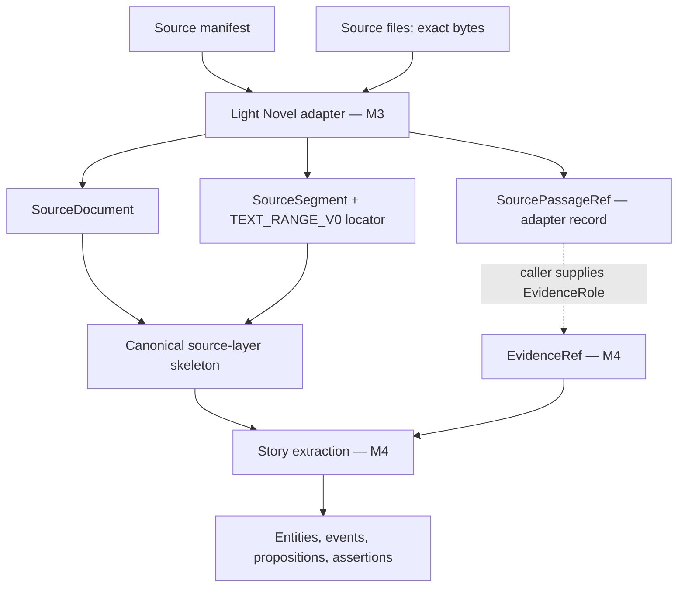

# M3 — Light Novel Ingestion Contract v0

Status: **FROZEN / ACCEPTED** (2026-10-01, Master Orchestrator / Project Owner authorization). Recorded in `DECISIONS.md` as DEC-018.

Freeze record (exact frozen identity and hashes): `benchmarks/m3_ingestion/LIGHT_NOVEL_INGESTION_V0_FROZEN.yaml`

History: baseline delivered in M3-01, validated on the private 30-document corpus in M3-02, frozen in M3-03. At freeze, only clarifications were added (the segment boundary rules in section 7, the evidence-role rule in section 13, and sections 19–20). The segmentation algorithm, locators, identifiers and fingerprint did not change.

Contract identity: `LIGHT_NOVEL_INGESTION/v0`

| Artifact | Role |
|---|---|
| `schemas/light_novel_ingestion/light_novel_source_manifest_v0.schema.json` | Input manifest contract (JSON Schema Draft 2020-12, as notation) |
| `tools/story_ingestion/light_novel_adapter_v0.py` | Validated reference implementation (`light_novel_adapter_v0/0.1.0`); see section 19 |
| `tests/story_ingestion/test_light_novel_adapter_v0.py` | Synthetic tests and one tracked-sample smoke test |
| `benchmarks/m3_ingestion/M3_01_LIGHT_NOVEL_ADAPTER_BASELINE_RESULT.yaml` | Mechanical result of this task |

Dependencies are those already declared in `requirements-canonical-story.txt` (`jsonschema`, `PyYAML`). Nothing uses a network, a model, a database or embeddings.

## 1. Purpose

M3-01 answers one question:

> Given an ordered set of controlled Light Novel text documents, how are they ingested deterministically while preserving exact source evidence, provenance and discourse order for M4 extraction?

The adapter conforms to the frozen Canonical Story Model (`canonical_story/v0`, DEC-016). It does not change any frozen artifact.

## 2. M3 / M4 Boundary

M3 establishes **where evidence came from**. M4 establishes **what that evidence means**.



| The adapter does | The adapter does not |
|---|---|
| Validate the manifest and verify source files | Recognise characters, places or events |
| Hash exact bytes and decode strictly | Extract mentions |
| Find paragraph segments with exact offsets | Assign evidence roles |
| Assign discourse positions | Infer chronology |
| Build source documents, segments and passage references | Create propositions or assertions |
| Emit a canonical source-layer skeleton and a report | Interpret dialogue, emotion or knowledge |

## 3. Input Manifest

The manifest describes an ordered collection of source documents for one story and one discourse stream.

```yaml
contract_version: LIGHT_NOVEL_INGESTION/v0
story_id: story-0001
stream_id: stream-0001-main
source_language: ja
documents:
  - document_id: srcdoc-0001
    order: 1
    path: text/unit_a.txt
    expected_sha256: <64 hex characters>
    editorial_label: Opening
```

Rules:

- `story_id`, `stream_id` and `document_id` follow the Canonical Story Id rule. They are caller-supplied, opaque and stable. They must not be derived from filenames or source-language names, and they must all differ.
- A document is any ordered unit: a chapter, a prologue, a side story, a volume part. The contract does not use the word "chapter".
- `order` is a non-negative integer, unique in the manifest. Values need not be contiguous. Reading order is ascending `order`. The order in which entries are listed does not matter.
- `path` is adapter metadata. It is relative to the source root (by default the manifest's directory), uses forward slashes, and may not contain `..`. It never contributes to identity.
- `expected_sha256` is the SHA-256 of the exact source bytes.
- Unknown fields are rejected.

The manifest may be YAML or JSON.

## 4. Source Identity and Version

Two things are kept apart:

| Concept | Value | Changes when |
|---|---|---|
| Document identity | `document_id` from the manifest | The caller decides it is a different document |
| Document version | SHA-256 of the exact source bytes | Any byte changes |

`SourceDocument.version` is the SHA-256 hex string. A corrected source file keeps its `document_id` and gets a new version.

`SourceDocument.media_kind` is `LIGHT_NOVEL_TEXT`.

## 5. Corpus Fingerprint

The fingerprint identifies the corpus, not its location.

```text
payload = {
  "contract_version": "LIGHT_NOVEL_INGESTION/v0",
  "story_id": ..., "stream_id": ...,
  "documents": [ {"order": ..., "document_id": ..., "version": ...}, ... ]   # ascending order
}
fingerprint = SHA-256( "LIGHT_NOVEL_CORPUS_FINGERPRINT_V0" + LF + compact JSON of payload )
```

Compact JSON means sorted keys, separators `,` and `:`, ASCII only.

- Changing document bytes, document order, a document id, the story id or the stream id changes the fingerprint.
- Moving the files, or renaming them, does not.
- The fingerprint of the historical retrieval benchmark (`7f9bb810…`) uses a different algorithm (ordinal and hash only). It stays the identity of that benchmark and is not a fingerprint under this contract.

## 6. Exact Source Preservation

```text
source bytes → SHA-256 → strict UTF-8 decode → exact text
```

The adapter does not strip, normalize Unicode, convert line endings, collapse whitespace, rewrite punctuation, remove blank lines or translate. Any such transformation belongs to a later stage and must not happen before provenance is fixed.

- Invalid UTF-8 is rejected.
- A byte-order mark is source content. It is kept and reported, not removed.
- Character offsets are **Unicode code points**. They are not UTF-16 units and not grapheme clusters. Byte offsets are offsets into the exact source bytes.

## 7. Paragraph Segmentation — `PARAGRAPH_SEGMENT_V0`

**Principle.** A `SourceSegment` is an evidence and provenance unit. It is not a retrieval unit.

```text
SourceSegment != RetrievalChunk
```

Later milestones may chunk, window, overlap or index text in any way. Those units must stay traceable to M3 source spans. No size, token window, overlap or embedding constraint is part of this contract.

**Definition.**

1. A line ends at `LF`, `CRLF` or a lone `CR`. Nothing else ends a line.
2. A line is **blank** if it contains only characters from a fixed list (below), or nothing.
3. Each maximal run of consecutive non-blank lines is one segment.
4. The segment is the exact source substring from the start of its first line to the end of the content of its last line. Line terminators inside the run belong to the segment. The terminator after the last line does not.
5. Leading and trailing whitespace on a non-blank line is source text and stays in the segment.
6. A paragraph is never split because of its length.
7. Text outside segments consists only of blank characters and line terminators. The adapter verifies this.

Blank characters (code points): `0009`, `000B`, `000C`, `0020`, `0085`, `00A0`, `1680`, `2000`–`200A`, `2028`, `2029`, `202F`, `205F`, `3000`. The list is fixed in the adapter, so the result does not depend on the Unicode tables of the Python version in use.

A document with no non-blank text is rejected.

### 7.1 SourceSegment semantic boundary

A `SourceSegment` is a mechanical provenance unit: a deterministic container produced from source formatting. It is **not** guaranteed to correspond to one semantic paragraph, scene, speaker, evidence role or content class.

Its boundary is determined by the `PARAGRAPH_SEGMENT_V0` source-format rules above, not by any understanding of the text.

### 7.2 Mixed-content segments

A segment may contain material that later receives different semantic roles, when the source places that material in the same non-blank run. Examples, by category:

- heading + prose;
- author note + prose;
- narration + dialogue.

This does not make the ingestion invalid. Interpreting the content belongs downstream. Such segments are accepted V0 behaviour; they are not claimed to be ideal.

### 7.3 Granularity rule

Segment granularity follows controlled source formatting and may legitimately differ between documents. One document may yield one segment per line, another one segment per block of lines.

## 8. DiscoursePosition Mapping

```text
key = [document order, segment ordinal]      # ordinal starts at 1 within the document
stream_id = the manifest's stream_id
```

- Lexicographic order of keys equals reading order.
- `display` is a human-facing label of the form `order.ordinal`.
- A discourse position is presentation order. It is **not** story time. The adapter infers no chronology.

## 9. Locator Contract — `TEXT_RANGE_V0`

Every segment carries:

```yaml
kind: TEXT_RANGE_V0
source_sha256: <document version>
char_start: ...
char_end_exclusive: ...
byte_start: ...
byte_end_exclusive: ...
segment_text_sha256: <SHA-256 of the segment's UTF-8 bytes>
document_order: ...        # navigation only
paragraph_ordinal: ...     # navigation only
```

Guaranteed and verified for every segment at ingestion:

```text
source_text[char_start:char_end_exclusive] == segment text
source_bytes[byte_start:byte_end_exclusive] decodes to the same text
SHA-256 of that text == segment_text_sha256
```

The locator holds no filesystem path and no source text. The navigation fields do not define identity.

## 10. Segment Identity

```text
id = "seg-" + first 40 hex characters of SHA-256( compact JSON of
       ["LIGHT_NOVEL_SEGMENT_ID_V0", "PARAGRAPH_SEGMENT_V0", story_id, document_id,
        document_version, char_start, char_end_exclusive, segment_text_sha256] )
```

- The id is opaque. No rule may read it.
- It contains no filename and no name from the story.
- It is deterministic: the same document version gives the same ids.
- The same text in two places gets two ids.
- Because the document version is an input, **any** change to a document's bytes gives every segment of that document a new id. A reference made against the old version cannot resolve against the new one.

## 11. SourcePassageRef — `SOURCE_PASSAGE_REF_V0`

An adapter-level record for an exact span inside one segment. It is **not** a Canonical Story record.

```yaml
kind: SOURCE_PASSAGE_REF_V0
story_id: ...
document_id: ...
document_version: ...
segment_id: ...
position: { stream_id: ..., key: [...], display: ... }     # the segment's position
relative_char_start: ...
relative_char_end_exclusive: ...
span:
  kind: TEXT_RANGE_V0
  source_sha256: ...
  char_start: ...            # global, derived from the segment start
  char_end_exclusive: ...
  byte_start: ...
  byte_end_exclusive: ...
  span_text_sha256: ...
```

- With no bounds given, the reference covers the whole segment.
- Sub-spans must satisfy `0 <= relative_start < relative_end <= segment length`. Anything else is rejected.
- The adapter can resolve a reference back to its exact text and can verify one. A reference that was altered, or made against another document version, is rejected.
- A passage reference has no evidence role.

## 12. Canonical L1 Skeleton

The adapter emits a `canonical_story/v0` document with:

| Collection | Content |
|---|---|
| `story` | `id`, `discourse_stream_id`, optional label |
| `source_documents` | One record per document |
| `source_segments` | One record per segment, in reading order |
| `evidence_refs`, `mentions`, `entities`, `events`, `temporal_anchors`, `propositions`, `extraction_provenance`, `assertions` | Empty |

The skeleton passes both the structural schema and the semantic conformance validator of the frozen model. Emission fails if it does not. `authority_policy` is `DEFAULT_V0`.

The skeleton contains no source text and no path. The text stays in the source files; the hashes and offsets tie the two together.

## 13. EvidenceRef Materialization Boundary

The frozen model requires every `EvidenceRef` to have an `EvidenceRole` (`DEPICTION`, `RETROSPECTIVE`, `IN_WORLD_REPORT`, `NARRATION_SUMMARY`, `PARATEXT`). Choosing a role means deciding what the passage is: depicted action, a report, a summary, paratext. That is story interpretation.

Therefore:

- The adapter creates **no** `EvidenceRef`. It does not label paragraphs `DEPICTION` to satisfy the schema.
- M4 turns a passage reference into an evidence reference once it has decided the role:

```python
materialize_evidence_ref(source_passage_ref, evidence_role, evidence_id)
```

- The caller supplies the role and the id. There is no default role.
- The helper checks mechanics only: the record kind, that the role is one of the five, and the id rule. It never infers or changes a role.
- The resulting record has the segment id, the segment's position, the span locator and the role, and validates against the frozen schema.

**Evidence-role rule (normative).**

- An `EvidenceRole` is assigned to the exact `EvidenceRef` span.
- No downstream component may infer that all text inside one `SourceSegment` shares one `EvidenceRole` merely because it shares a `SourceSegment`. In particular, M4 must not assume one segment equals one role.
- A `SOURCE_PASSAGE_REF_V0` sub-span may be used to materialize a role-specific `EvidenceRef`. Two spans of one segment may carry different roles.

## 14. Re-ingestion Behaviour

| Situation | Document version | Corpus fingerprint | Segment ids |
|---|---|---|---|
| Same manifest identities, same bytes | Same | Same | Same |
| Files moved or renamed | Same | Same | Same |
| One document's bytes changed | New for that document | New | New for that document; unchanged for the others |
| Document order changed | Same | New | Same ids, new positions |
| Document id changed | Same | New | New for that document |

Running the adapter twice on the same input gives byte-identical serialized output (sorted keys, two-space indent, LF, UTF-8). The adapter does not depend on directory listing order.

M3-01 does not provide migration between versions of a document. It only guarantees that a stale reference does not appear valid.

## 15. Relationship to `PARAGRAPH_PACK_V1`

`tools/story_ingestion/paragraph_pack_v1.py` is the chunker of the M1 retrieval benchmark. It is historical research infrastructure and is left unchanged. Its tests still pass, and a test checks that the file is byte-identical.

**Ideas reused** (re-implemented, not imported):

- hashing the exact bytes before anything else;
- strict UTF-8 decoding;
- exact character offsets and exact source-slice checks;
- keeping line endings as they are;
- paragraphs as runs of non-blank lines;
- deterministic output.

**Benchmark-specific concepts that are not M3 semantics:**

| Concept in `PARAGRAPH_PACK_V1` | Why it is not adopted |
|---|---|
| `OTONARI_LOCAL_PASSAGE_V1` contract id | Names one corpus |
| Packing paragraphs into chunks of up to 1200 characters | A retrieval size choice |
| Hard split of a paragraph longer than 1200 characters | Cuts an evidence unit at an arbitrary character |
| `chNNN_cNNNN` ids | Encode chapter number and chunk index; not opaque; unchanged when content changes |
| Chapter numbers and a fixed count of 30 | The contract has ordered documents of any kind and number |
| Hard-coded repository and private output paths | Location must not matter |
| Fingerprint over ordinal and hash only | Does not bind story, stream, document identity or contract version |
| Blank detection by `str.strip()` and `str.splitlines()` | Depends on the Python version's Unicode tables; treats more characters as line breaks |
| Chunk includes the trailing line terminator | A segment ends at the end of its last line's content |
| No byte offsets | Needed for exact round-trip on multi-byte text |

No code is shared between the two modules. A shared library was considered and rejected for now: the differences above are in the low-level primitives themselves, and changing the historical module would put its recorded outputs at risk.

## 16. Failure Modes

The adapter fails closed. It raises one error type with a code and never repairs input.

| Code | Cause |
|---|---|
| `MANIFEST_NOT_FOUND` | Manifest file missing |
| `INVALID_MANIFEST` | Unparseable manifest, or schema violation (wrong contract version, missing or unknown field, bad id, bad hash format, no documents) |
| `DUPLICATE_DOCUMENT_ID` | Two documents share an id |
| `DUPLICATE_DOCUMENT_ORDER` | Two documents share an order |
| `ID_COLLISION` | Story, stream and document ids are not all different |
| `INVALID_SOURCE_PATH` | Absolute path, backslash, drive letter or `..` |
| `SOURCE_NOT_FOUND` | Source file missing |
| `SHA256_MISMATCH` | Source bytes differ from `expected_sha256` |
| `INVALID_UTF8` | Source is not valid UTF-8 |
| `EMPTY_DOCUMENT` | Document has no non-blank text |
| `ROUND_TRIP_FAILED` | Internal check failed: offsets, hashes or coverage disagree |
| `DUPLICATE_SEGMENT_ID` | Two segments received one id |
| `CANONICAL_INCOMPATIBLE` | The skeleton does not validate against `canonical_story/v0` |
| `UNKNOWN_SEGMENT`, `INVALID_SPAN` | Bad passage reference request |
| `INVALID_PASSAGE_REF`, `STALE_PASSAGE_REF` | Reference altered, or made against another version |
| `INVALID_EVIDENCE_ROLE`, `INVALID_ID` | Bad arguments to evidence materialization |

## 17. Known Limitations

1. **Plain UTF-8 text only.** No EPUB, HTML, ruby or furigana markup, illustrations, or front-matter handling.
2. **Paragraphs are separated by blank lines only.** A source that separates paragraphs with single line breaks gives one segment per block of consecutive lines.
3. **No mapping between document versions.** Any byte change renews all segment ids of that document.
4. **Segment-granular discourse positions.** A sub-span reference shares its segment's position.
5. **One discourse stream per manifest**, as in `canonical_story/v0`.
6. **Code-point offsets.** Consumers working in UTF-16 or grapheme clusters must convert.
7. **A byte-order mark stays in the first segment.**
8. **Whole documents are held in memory.**
9. **No paratext detection.** Front or back matter inside a document is segmented like any other text; deciding it is paratext is an evidence-role decision for M4.
10. **Narrow validation.** Synthetic input, five tracked sample documents, and the private 30-document corpus of one story, one source and one language. The longest real segment has 299 characters, so the no-split rule for long paragraphs was exercised only synthetically.
11. **Mixed semantic material can share a segment** (sections 7.1–7.2). On the validated corpus, 16 of 1519 segments join a heading or an author note with adjacent story text.
12. **Granularity differs between documents** (section 7.3).

These limitations are accepted for V0. They do not invalidate it.

## 18. Validation Status

- **M3-01:** 50 synthetic adapter tests and a smoke test over five tracked sample documents. Result: `benchmarks/m3_ingestion/M3_01_LIGHT_NOVEL_ADAPTER_BASELINE_RESULT.yaml`.
- **M3-02:** private validation on the 30-document controlled corpus: 1519 segments, exact round-trip, byte-identical independent reruns, canonical conformance, and all 97 historical retrieval chunks traced to segments with none untraceable. Result: `benchmarks/m3_ingestion/M3_02_PRIVATE_CORPUS_VALIDATION_RESULT.yaml` and `M3_PRIVATE_CORPUS_INGESTION_VALIDATION.md`.

## 19. Normative Artifacts and Reference Implementation

**Normative contract artifacts.** These define `LIGHT_NOVEL_INGESTION/v0`:

- this document;
- `schemas/light_novel_ingestion/light_novel_source_manifest_v0.schema.json`.

**Validated reference implementation.** `tools/story_ingestion/light_novel_adapter_v0.py`, identity `light_novel_adapter_v0/0.1.0`.

- It is a validated, executable reference for the frozen contract.
- It is not the contract, and it is not the only implementation that may conform to V0.
- A later implementation may replace or refactor it if it preserves the frozen externally observable semantics and passes conformance evidence.

Canonical dependency: `canonical_story/v0` with `predicate_registry/v0.1` (DEC-016).

## 20. Evolution Rules

**Implementation patch.** Allowed without changing `LIGHT_NOVEL_INGESTION/v0` when all of these hold:

- contract outputs and identity semantics do not change;
- manifest acceptance semantics do not change;
- segmentation output for the same valid input does not change;
- the corpus fingerprint does not change;
- locator meaning does not change;
- passage-reference semantics do not change;
- regression and conformance tests pass.

A patch gets a new adapter implementation version and a validation record.

**Contract-breaking change.** A new ingestion contract version is required for any change to:

- manifest semantics;
- `SourceDocument` version semantics;
- the corpus fingerprint;
- `PARAGRAPH_SEGMENT` semantics;
- segment identity semantics;
- the `DiscoursePosition` mapping;
- the meaning of `TEXT_RANGE`;
- the meaning of `SOURCE_PASSAGE_REF`;
- source-preservation guarantees;
- the M3/M4 evidence-role boundary.

There is no silent change to V0. Frozen artifacts are not modified in place.

M3 is frozen. M4 has not started.
