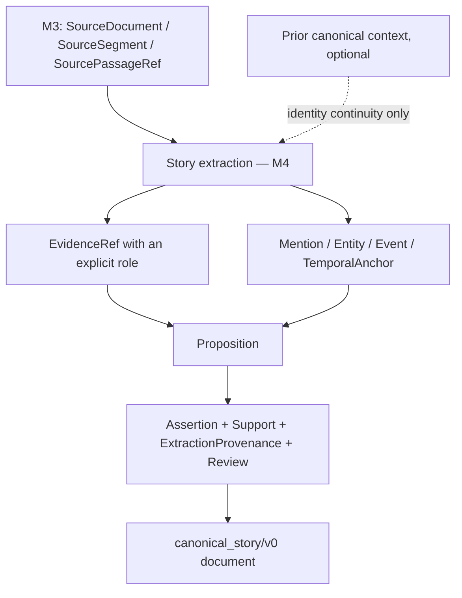

# M4 — Story Extraction Contract v0

Status: RESEARCH BASELINE — TASK M4-01. Pending Orchestrator review. **Not frozen.** Not recorded in `DECISIONS.md`.

Contract identity: `STORY_EXTRACTION/v0`. Process envelope: `STORY_EXTRACTION_BATCH/v0`.

| Artifact | Role |
|---|---|
| `schemas/story_extraction/story_extraction_batch_v0.schema.json` | Envelope schema (process record only) |
| `tools/story_extraction/extraction_contract_v0.py` | Batch validation and deterministic merge. Performs no extraction |
| `tools/story_extraction/evaluate_extraction_v0.py` | Evaluator skeleton (see `M4_EXTRACTION_EVALUATION_PROTOCOL_V0.md`) |
| `tests/story_extraction/` | 26 synthetic contract fixtures and tests |
| `benchmarks/m4_extraction/M4_01_EXTRACTION_CONTRACT_BASELINE_RESULT.yaml` | Result of this task |

No model was selected or run. No real-source extraction was done.

## 1. Purpose

M4 turns ingested text into grounded story understanding. This contract answers:

> Given exact M3 source evidence, what may an extractor emit into the frozen Canonical Story Model, what grounding is required, and how is correctness judged?

It defines the measuring stick. It does not say which extractor to use, and it does not claim any extractor meets it.

Frozen inputs, none of which this contract changes:

- `canonical_story/v0` with `predicate_registry/v0.1` (DEC-016);
- `LIGHT_NOVEL_INGESTION/v0` (DEC-018).

## 2. M3 / M4 Boundary



- M3 says where evidence came from. M4 says what it means.
- M4 creates no provenance. A batch cannot contain source documents or source segments.
- M4 does not persist anything across runs. Persistent story memory is M5.

## 3. Input: ExtractionScope

`ExtractionScope` states what the extractor was given. It is a process record at the M4 orchestration layer. **It is not a Canonical Story record.**

| Field | Meaning |
|---|---|
| `story_id` | The story of the base canonical document |
| `ingestion` | The M3 contract version and the corpus fingerprint |
| `passage_inputs` | Ordered `SOURCE_PASSAGE_REF_V0` records, each marked `EVIDENCE_ELIGIBLE` or `CONTEXT_ONLY` |
| `as_of_position` | Discourse boundary. No input and no evidence may lie after it |
| `prior_canonical_context` | `NONE`, or `BASE_DOCUMENT_RECORDS` when the base document already holds earlier canonical records |
| `profile_id` | Identity of the extraction task or profile |

**Evidence unit is not the model context window.** Provenance segments in the validated corpus are 3–299 characters. An extractor may be shown several passages, adjacent context and prior canonical context at once. This mirrors `SourceSegment != RetrievalChunk`. No window or token size is fixed.

**Context does not create evidence** (normative).

- A passage marked `CONTEXT_ONLY` helps interpretation. It can never be cited as evidence.
- Being visible to the extractor does not make a passage evidence. Only the exact passages that actually support an assertion enter its evidence sets.
- Prior canonical context may help resolve identity. It must not be re-emitted as fresh evidence from the current passages.

## 4. Extraction Batch

One run emits one `STORY_EXTRACTION_BATCH/v0`:

```yaml
batch_version: STORY_EXTRACTION_BATCH/v0
contract_version: STORY_EXTRACTION/v0
process: {method, process_id, process_version, run_id?, human_review_record?}
scope: { ...ExtractionScope... }
base_canonical_identity: {schema_version: canonical_story/v0, base_document_sha256}
candidate_records:
  evidence_refs: []
  mentions: []
  entities: []
  events: []
  temporal_anchors: []
  propositions: []
  extraction_provenance: []
  assertions: []
```

The envelope is not a competing story schema. Every record inside `candidate_records` has exactly the frozen Canonical Story shape.

**Why the envelope schema is minimal.** The envelope schema does not copy or reference the Canonical Story schema. Cross-file JSON Schema references are brittle, and a copy would be a second definition that could drift. Record shapes are checked where they are defined: by the frozen validator, after the merge.

**Validation strategy.**

```text
base canonical document  +  candidate records
        → deterministic merge (base order kept; candidates appended, sorted by id)
        → frozen canonical_story/v0 validator (structural + semantic)
```

Batch checks before and around the merge:

| Check | Rejects |
|---|---|
| Envelope | Wrong versions, missing fields, source-layer or non-canonical collections |
| Scope | Wrong story, wrong base document identity, input after the as-of boundary, misdeclared prior context, passage references that do not match the source |
| Ids | A candidate id that already exists in the base document or twice in the batch |
| Evidence | Missing span or role, span outside its segment, span outside an evidence-eligible input, evidence after the boundary, span that does not match the exact source |
| Review and provenance | See section 7 |
| Canonical | Anything the frozen validator rejects: dangling references, unregistered predicates or rules, missing support, invalid enum values, duplicate proposition content, epistemic gates |

The base document is identified by the SHA-256 of its deterministic serialization. A batch is valid only against the base it was produced for.

## 5. Canonical Output Requirements

An extractor may emit only records the frozen model defines:

- `EvidenceRef`, `Mention`, `Entity`, `Event`, `TemporalAnchor`, `Proposition`, `ExtractionProvenance`, `Assertion`;
- embedded: `EvidenceSet`, `Derivation`, `ValidityInterval`, `ReviewRecord`.

It must not emit parallel semantic records (a character fact, a relationship object, a secret object, an event DTO, a knowledge record). The envelope schema rejects unknown collections.

**Ids.** Candidate ids must satisfy the Canonical Id rule, be opaque, and avoid filenames and source-language names. They must be deterministic within a run or fixture where reproducibility is required. Entity identity must never depend on a display name. Production-wide id allocation is left to M5.

## 6. Evidence Discipline

**Every direct claim traces to exact M3 spans.**

- M4 consumes `SOURCE_PASSAGE_REF_V0` and materializes `EvidenceRef` records.
- Every evidence reference carries an exact `TEXT_RANGE_V0` span and an explicitly chosen `EvidenceRole`.
- There is no default role. In particular, nothing is `DEPICTION` by default. Choosing a role is semantic interpretation.

**Mixed segments.** One `SourceSegment` is not one `EvidenceRole`. When a segment holds heading and prose, author note and prose, or narration and dialogue, the extractor uses exact sub-spans wherever roles differ. It must not classify a whole segment from one part of it.

**Evidence role guidance (V0).** The enum is frozen; this is guidance for choosing.

| Role | Use for | Not for |
|---|---|---|
| `DEPICTION` | Action, speech or perception shown as it happens in the current scene | A character's account of something else |
| `RETROSPECTIVE` | Narration that looks back at an earlier time: flashback, "it had been…", later-revealed detail | Events of the current scene |
| `IN_WORLD_REPORT` | What a character says, writes or reports inside the story | The narrator's own statement |
| `NARRATION_SUMMARY` | The narrator summarizing, generalizing or stating a standing fact | A single depicted moment |
| `PARATEXT` | Headings, author notes, anything outside the story world | Story content. Under `DEFAULT_V0` it cannot ground a story-world assertion |

Hard contrasts:

| Passage | Evidence for | Role |
|---|---|---|
| A character says that an event happened | That the character said it (`Says`) | `DEPICTION` of the utterance; the quoted words are an `IN_WORLD_REPORT` of the event |
| The narrator states a habit or a lasting state | The state | `NARRATION_SUMMARY` |
| The narrator recounts an earlier scene | The earlier event | `RETROSPECTIVE` |
| An author note after the last line | Nothing in the story world | `PARATEXT` |
| An action in the scene | The event | `DEPICTION` |

**Support.**

- Every direct assertion has source support. Normally at least one `SUFFICIENT` evidence set, when the evidence is independently sufficient.
- `CORROBORATING` and `PARTIAL` keep their frozen meanings. They never make an assertion available.
- Evidence is not `SUFFICIENT` merely because it is the only evidence available. If the available evidence does not establish the claim, do not assert it at that strength, or do not assert it.

**Direct extraction versus rule derivation.**

| | Path | Support |
|---|---|---|
| Direct | Source evidence → proposition and assertion | Evidence sets |
| Derived | Existing assertions + a **registered** rule → assertion | `Derivation` with a registry `rule_id` |

A model's inference is not a canonical derivation. Only the four registered rules may appear in `rule_id`. Otherwise the result is expressed with the right epistemic status and direct support, or not emitted. Rule ids must not be invented.

## 7. Review and Provenance Rules

**An automated extractor must not certify its own output.**

| Producer | `ExtractionProvenance.method` | Review state |
|---|---|---|
| Automated extractor | `AUTOMATED_EXTRACTION` | `UNREVIEWED`, with no reviewer |
| Human annotation, or an AI agent drafting gold | `HUMAN_ANNOTATION` | `UNREVIEWED` until an actual human review |
| After actual human review | `HUMAN_ANNOTATION` | `CONFIRMED` or `CORRECTED`, `reviewer_kind: HUMAN`, and the batch names the review in `human_review_record` |

- A model saying it is confident does not make an assertion `CONFIRMED`.
- An agent-authored fixture is not human-confirmed. An agent must not fill in `human_review_record` on its own authority.
- Evaluation scores predictions. It never changes their review state.
- Every assertion in a batch cites provenance created by that batch, and that provenance names the batch's process.

**Extraction confidence.** `ExtractionProvenance.confidence` is confidence of the extraction process. It is not the probability that the story fact is true. It never replaces epistemic status, polarity, review state or evidence. No threshold-based acceptance is defined.

## 8. Entity and Mention Semantics

- A mention is not an entity. A name is not an identity.
- A name or reference in the text is first located as a `Mention` (an exact evidence span plus its surface form).
- Resolution is the assertion `RefersTo(mention, entity)`.
- An `Entity` record carries no naming fact. Names are `NamedAs` assertions.
- **Unknown referents.** A placeholder entity (`placeholder: true`) is created only when the extracted semantics need an identity for a not-yet-identified referent. Later resolution is `SameAs`. Earlier records are not rewritten.

## 9. Event Semantics

- An `Event` record does not mean the event occurred. Occurrence is the assertion `Occurred(event)`, with its own support.
- An event that is only reported, believed or intended exists as a record and appears inside holder-relative content. It has no canonical `Occurred` assertion unless the source establishes it independently.

**Granularity guidance.** An event is one narratively identifiable occurrence that can:

- have participants;
- have a location;
- take part in temporal relations;
- be a cause or an effect;
- bound a state change.

Avoid one event per sentence, and avoid one event per scene or document. V0 does not solve event individuation. Granularity is an evaluation concern (protocol, section 6).

## 10. State and Relationship Semantics

- State predicates include `Possesses`, `Owns`, `LocatedAt`, `Regard`, `PhysicalCondition`, `EmotionToward`, `Intends`, `Habitually`, `NamedAs`, `AddressesAs`.
- A state is not assumed to last forever. Validity bounds are stated only when evidence supports them.
- A missing end stays `OPEN`. An end is not invented.
- An end learned later is an anchored bound with its own support from the later evidence.
- A later state is never derived from discourse order.
- **Causality.** `Causes` and `Enables` are strong commitments. Order of events and adjacency of clauses are not evidence of causation. Causal assertions need explicit or sufficiently entailed evidence. Unsupported causal strengthening is a high-value failure.
- **Relationships.** No persistent relationship object is emitted. A relationship is a later view over assertions such as `Regard`, `AddressesAs` and `EmotionToward`. Relationship progression is derived, not stored.

## 11. Information and Knowledge Semantics

The extractor keeps these apart:

| What the source establishes | Canonical form |
|---|---|
| Something is the case | An assertion of the proposition |
| A character says it | `Says(speaker, content, polarity)` |
| A character believes, suspects or perceives it | `Attitude(holder, kind, content, polarity)` |
| A character intends it | `Intends(holder, content, polarity)` |
| It is conveyed in an event | `Conveys(event, content, polarity)` |
| A character conceals it | `Conceals(concealer, content, polarity, from)` |

**Holder-relative rule (testable).** If the source establishes that a character says, believes or intends P, the extractor may assert that holder-relative proposition. It must **not** thereby assert P. A self-report does not make an internal state canonical. A reported event does not become an occurred event.

`KNOWS`, `MISTAKEN` and `SECRET` are derived views. They are never stored.

## 12. Epistemic Rules

Exactly three statuses exist, with their frozen meanings:

| Status | Meaning |
|---|---|
| `EXPLICIT` | Directly stated or shown by the evidence |
| `ENTAILED` | Follows necessarily from what is established |
| `SUGGESTED` | Indicated but not established |

- No status is added. There is no `REPORTED`, `UNKNOWN`, `LIKELY` or `CERTAIN`.
- Reported content is expressed through perspective predicates (`Says`, `Attitude`), not through a status.
- Unknown content uses the existing mechanisms: `OPEN` polarity, placeholder propositions.
- Internal states (`Regard`, `Attitude`, `Conceals`, `EmotionToward`, `Intends`) may be `EXPLICIT` only with depiction or narration evidence. A self-report alone cannot make them `EXPLICIT`. The frozen validator enforces this.

## 13. Atomicity and Coverage

**Atomicity.** One assertion per atomic canonical commitment. "A owns X, gives X to B and feels sad" is three or more propositions, not one. Independent truth conditions are separated so that evidence, review, validity and correction stay local.

**Coverage is not "extract everything".** V0 targets story-relevant structured understanding. Normally include what matters to:

- event progression;
- entity identity and resolution;
- participant roles;
- state changes;
- relationship changes;
- knowledge and information flow;
- causality;
- location, possession and ownership;
- important explicit emotion and intention;
- later retrieval and storytelling.

Normally leave out every decorative adjective, every syntactic relation and every trivial sentence fact, unless story understanding needs it.

## 14. Failure Taxonomy

| Group | Code | Meaning |
|---|---|---|
| Structural | `CANONICAL_CONFORMANCE_FAILURE` | The batch or merged document is invalid |
| Coverage | `MISSED_REQUIRED_ASSERTION` | A required commitment is absent |
| Coverage | `MISSING_ENTITY_RESOLUTION` | A required `RefersTo` is absent |
| Invention | `UNSUPPORTED_ASSERTION` | A commitment the source does not support |
| Invention | `HOLDER_RELATIVE_TRUTH_LEAK` | Said, believed or intended content asserted as canonical |
| Invention | `INVENTED_CAUSALITY` | Unsupported `Causes` or `Enables` |
| Content | `WRONG_PREDICATE` | The right fact under the wrong predicate |
| Content | `WRONG_ARGUMENT` | Wrong participant, role, value or direction |
| Content | `WRONG_POLARITY` | Affirmed for negated, or the reverse |
| Content | `EPISTEMIC_OVERSTATEMENT` | Stronger status than the evidence gives |
| Content | `EPISTEMIC_UNDERSTATEMENT` | Weaker status than the evidence gives |
| Content | `WRONG_VALIDITY_BOUND` | Invented, missing or wrong bound |
| Content | `NON_ATOMIC_ASSERTION` | Several commitments in one proposition |
| Content | `DUPLICATE_ASSERTION` | The same commitment twice |
| Referent | `WRONG_ENTITY_RESOLUTION` | A mention resolved to the wrong entity |
| Referent | `WRONG_EVENT_GRANULARITY` | One event split, or several merged |
| Grounding | `WRONG_EVIDENCE_SPAN` | The cited span does not support the claim |
| Grounding | `WRONG_EVIDENCE_ROLE` | Right span, wrong role |
| Grounding | `INSUFFICIENT_SUPPORT_MARKED_SUFFICIENT` | Partial evidence labelled sufficient |

The evaluator skeleton assigns 15 of these 19 codes mechanically. `WRONG_PREDICATE`, `WRONG_ARGUMENT`, `WRONG_EVENT_GRANULARITY` and `NON_ATOMIC_ASSERTION` need a judgement about what the extractor meant. Mechanically they appear as a missed assertion plus an unsupported one; a reviewer relabels them.

**Severity.** Severity reflects the effect on downstream story understanding, not the code alone.

| Level | Typical cases |
|---|---|
| `CRITICAL` / `HIGH` | Unsupported major event; wrong entity identity; holder-relative belief promoted to canonical truth; temporal leakage that causes a spoiler; invented causal chain; polarity that reverses a material fact |
| `MEDIUM` | Missed secondary state; wrong evidence role; over-broad evidence span; missing corroborating detail |
| `LOW` | Minor granularity disagreement; non-material duplicate; editorial-label issue |

## 15. Known Limitations

1. **Research baseline.** Nothing here is frozen. No real-source extraction has been run against it.
2. **Synthetic fixtures only.** The 26 fixtures are invented English text. Their gold is agent-authored and unreviewed.
3. **Event individuation is unsolved.** Guidance only.
4. **Coverage is guidance.** "Story-relevant" is not operationalized; per-case required sets are decided by the gold author.
5. **Context-only marking is declared, not proven.** The validator checks that evidence lies inside eligible inputs. It cannot check that a cited passage truly supports the claim.
6. **Evidence roles need judgement.** The guidance table will meet hard cases (free indirect speech, focalized narration).
7. **Inherited canonical limitations** remain: existential content, resolution propagation, omission causation, focalization, speech acts, conditional bounds, repeated utterances (DEC-016).
8. **Id allocation across runs** is deferred to M5.
9. **No extractor, prompt or model** is defined, selected or evaluated.
